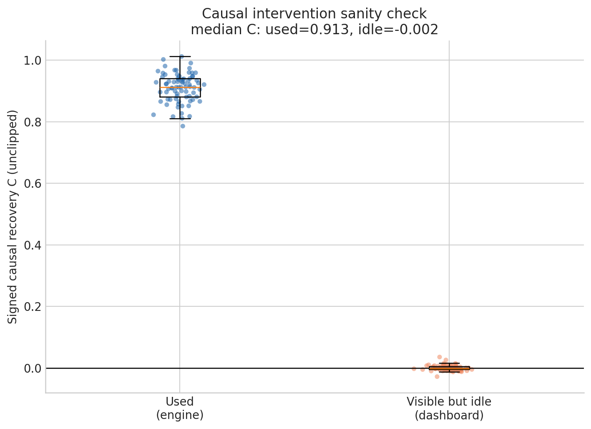
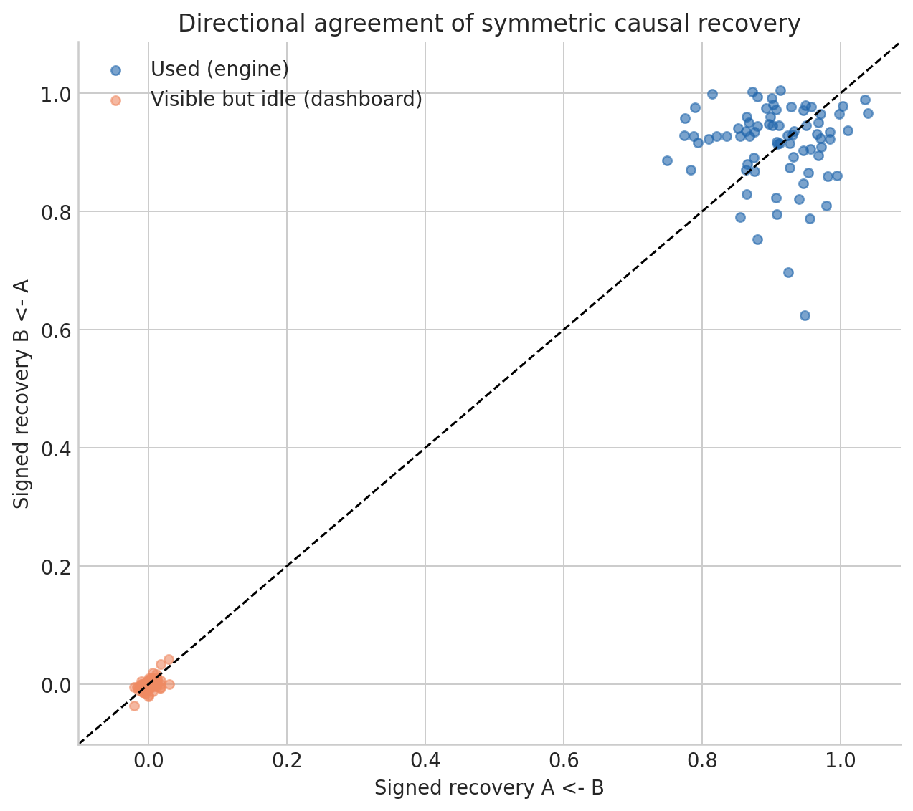
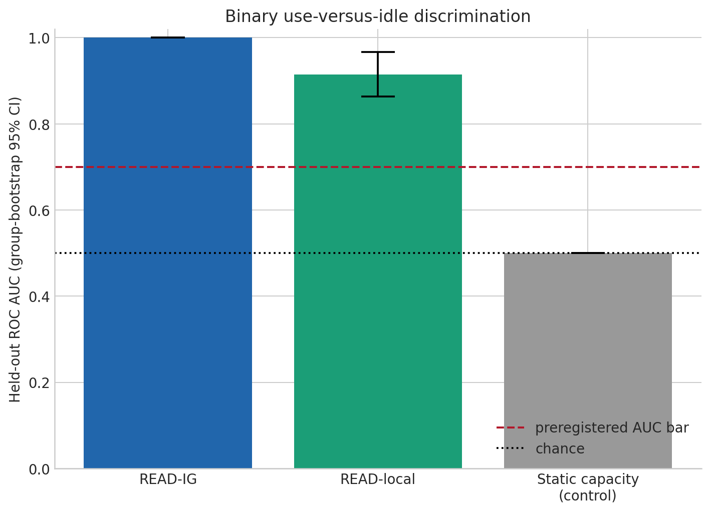
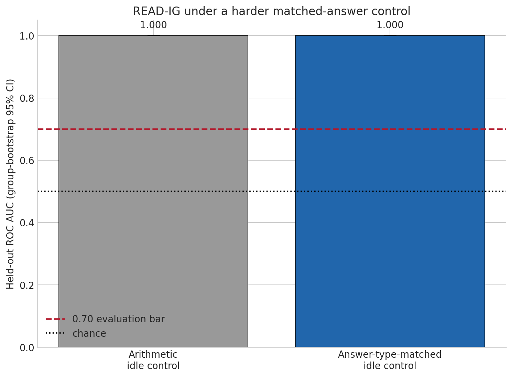
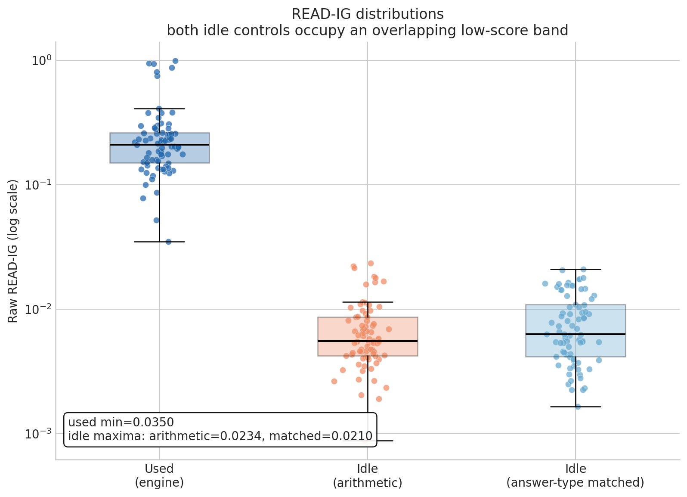
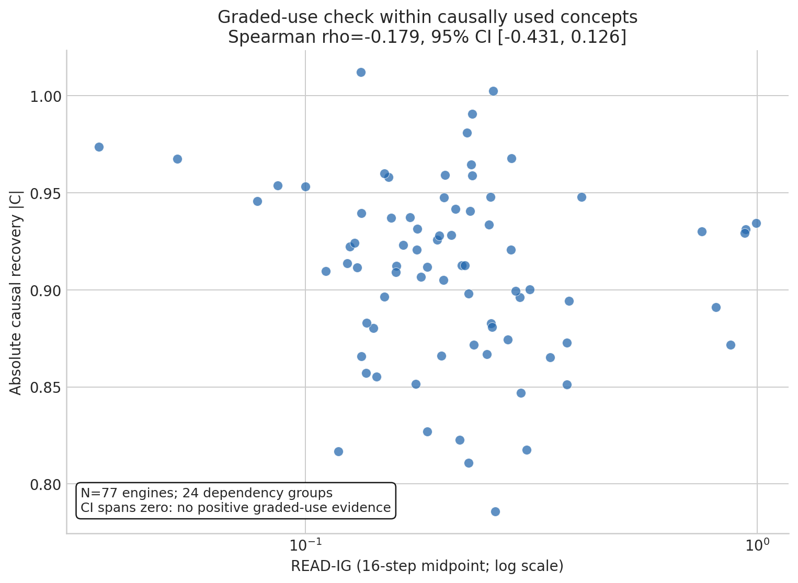

# Visible but Idle: A Gradient-Only Detector of Concept Use Validated by Symmetric Causal Interchange

## Abstract

Methods that translate hidden activations into words can reveal that a concept is represented inside a language model, but not whether it contributes to the model's next behavior. We study this distinction using Anthropic's Jacobian Lens (J-Lens) and J-Space as the representational foundation. Our contribution is not a new lens: it is a candidate *READ* signal and an intervention-based test of what that signal can support.

We construct matched prompts in which the same explicit concept is either needed for the answer (an *engine*) or visible but irrelevant (a *dashboard*). On Qwen2.5-7B-Instruct at layer 16, we verify that the concept is represented in both cases, establish causal ground truth by interchanging the complete residual state at the concept token in both directions, and evaluate `READ_IG`, which integrates output gradients along a path between paired J-Lens directions. The gradient path is firewalled from causal results.

Of 118 candidates, 25 are reserved for calibration and 93 for evaluation; 77 evaluation pairs in 24 dependency groups pass all frozen gates. `READ_IG` separates engines from both original and answer-type-matched idle controls with ROC AUC 1.000 (95% group-bootstrap CI [1.000, 1.000]). A local-gradient score reaches 0.915 [0.864, 0.967], while a static capacity baseline is 0.500. The stronger interpretation fails: within engines, `READ_IG` does not rank causal magnitude (Spearman's rho = -0.179, 95% CI [-0.431, 0.126]). This is evidence for a binary relevant-versus-idle detector in one narrow setting, not a graded causal-use meter.

## 1. Introduction

A model can represent a concept without using it for the behavior under examination. A prompt about aluminum may leave a clear aluminum-related state even when the requested answer is `2 + 2`. An interpretability display may surface *aluminum* in both that prompt and a chemistry question, but a behavioral audit should distinguish them: changing the concept should change the chemistry answer and leave the arithmetic answer alone.

Direct intervention can test that distinction, but it is awkward as a routine screen. It requires a suitable donor, cached internal states, edited forward passes, and a normalization that makes effects comparable. A gradient score could be useful as an earlier filter if it predicts the same relevant-versus-idle contrast without consuming intervention outputs. The important scientific question is therefore not whether gradients can correlate with an intervention on a pooled dataset, but whether a frozen gradient rule survives held-out, causally checked controls.

Anthropic's work on [verbalizable representations and the global workspace](https://transformer-circuits.pub/2026/workspace/index.html) supplies our starting point. Its [J-Lens reference implementation](https://github.com/anthropics/jacobian-lens) transports an internal residual vector through an average Jacobian and decodes it in the model's vocabulary. We reproduce and use that machinery; we do not claim it as our contribution.

Our question begins after a concept has surfaced: can we predict whether downstream computation uses it without running a donor-state intervention every time? This matters for monitoring because treating every visible trace as active can create false alarms and false mechanistic explanations. In commentary accompanying Anthropic's report, Neel Nanda asks for more evidence about reliability and false-positive behavior ([pp. 41--42](https://www-cdn.anthropic.com/files/4zrzovbb/website/cc4be2488d65e54a6ed06492f8968398ddc18ebe.pdf)). This controlled experiment provides one small piece of such evidence.

We call concept visibility **WRITTEN** and behavior-conditioned sensitivity **READ**. These are operational labels, not claims to a unique semantic variable or complete circuit. Our result is asymmetric: `READ_IG` perfectly separates the frozen relevant and idle classes, including a harder matched-answer control, but does not order relevant examples by causal strength. We therefore claim a binary detector under these conditions, not a graded ruler.

The practical contributions are a symmetric full-residual causal score for matched concept pairs, a donor-free gradient estimator behind an explicit anti-circularity firewall, and a report of both the successful binary test and failed graded test. “Gradient-only” distinguishes READ from donor interchange; it does not mean free. `READ_IG` requires 16 gradient-bearing midpoint evaluations per direction, and we did not benchmark runtime or claim a measured speedup.

## 2. Background: from J-Lens visibility to behavioral use

### 2.1 Anthropic's J-Lens and J-Space

J-Lens is an Anthropic-developed method for reading verbalizable content from residual-stream activations. In simplified notation, it transports a residual vector $h_\ell$ to the final residual basis using an average input-output Jacobian $J_\ell$, applies the model's normalization, and decodes with its unembedding $U$:

$$
\operatorname{lens}_\ell(h_\ell) = U\,\operatorname{norm}(J_\ell h_\ell).
$$

The resulting vocabulary scores describe which words an activation is disposed to make the model say. Anthropic's J-Space analysis studies the verbalizable directions as a sparse workspace shared across computations. Its method, published lenses, and canonical swaps are upstream work. The reference repository and its synthetic data are Apache-2.0 licensed.

This representational foundation is useful precisely because a readable direction can be reused across prompts. It also creates the ambiguity studied here: a direction may be active because the prompt mentions its concept, even when the requested computation has no reason to consult it. A visibility probe and a behavior-specific use test therefore answer different questions.

For concept direction $v$ and residual state $h$, we use $h^\top v$ as the WRITTEN quantity. Calibration selects layer 16 and a threshold of 2.482431. Passing says that the concept is detectable at that token and layer; it does not say the concept affects the answer.

### 2.2 WRITTEN is not READ

An *engine* prompt uses a concept to determine its completion. A matched *dashboard* retains the same fact context and explicit concept token but asks an unrelated question. We use causal interchange to validate that contrast and then ask whether a separate gradient score predicts the constructed class. WRITTEN is an inclusion gate, not a positive label; ROC labels are the relevant and idle tasks, not a thresholded version of either READ or the causal score.

`READ_IG` adapts [Integrated Gradients](https://arxiv.org/abs/1703.01365) to an activation-space path between paired J-Lens directions. It measures sensitivity of a specific answer metric without using a clean donor activation or reading causal outputs.

## 3. Method

### 3.1 Model, data, and frozen split

All experiments use `Qwen/Qwen2.5-7B-Instruct`, revision `a09a35458c702b33eeacc393d103063234e8bc28`, in bfloat16; the family is documented in the [Qwen2.5 technical report](https://arxiv.org/abs/2412.15115). We fix seed 1729, five folds, and 10,000 bootstrap draws. A 20-prompt wrapper check gives maximum mean KL $1.66\times10^{-8}$, below the $10^{-3}$ gate.

The dataset has 118 deterministic reciprocal pairs covering element symbols, country capitals, and US-state capitals. Repeated contexts using the same unordered concepts share a dependency group. Whole groups are allocated to calibration until 25 pairs are reserved, leaving 93 evaluation candidates. Calibration alone selects layer and WRITTEN threshold.

Reciprocity means that each prompt pair supports both $A\rightarrow B$ and $B\rightarrow A$ reasoning under one shared relation. Grouping prevents near-duplicates built from the same concepts from appearing as independent evidence across folds or bootstrap draws. It also makes the reported sample size less flattering but more faithful: 77 rows are supported by 24 independent evaluation groups, not 77 unrelated semantic units.

A pair must pass frozen checks in both directions: the engine's clean top completion is correct; the own-concept projection at the explicit concept token exceeds threshold; the idle control gives its declared answer; and that concept remains WRITTEN in the control. Seventy-seven pairs pass and 16 remain `UNVERIFIED`; none is relabeled. The verified pairs span 24 evaluation groups. The intervention location is the explicit concept token at L16 in a byte-identical shared fact context.

### 3.2 Expensive causal ground truth

For matched concepts $A,B$, define the final-token answer metric and clean scale

$$
M=\operatorname{logit}(y_A)-\operatorname{logit}(y_B), \qquad T=M_A-M_B.
$$

We capture each clean post-block residual at the concept token, install $B$'s complete state into $A$ and vice versa, and compute

$$
R_{A\leftarrow B}=\frac{M_A-M_{A\leftarrow B}}{T}, \qquad
R_{B\leftarrow A}=\frac{M_{B\leftarrow A}-M_B}{T}, \qquad
C=\frac{R_{A\leftarrow B}+R_{B\leftarrow A}}{2}.
$$

$C$ remains signed and unclipped. A directional discrepancy above 0.50 is pre-flagged; none occurs in the final engine or control measurements. Controls use their own answer metric while retaining their engine's $T$, expressing a control effect relative to the behavior it contrasts. This operation requires clean donors and two edited forwards per pair. We treat it as causal ground truth for this experiment, not as the monitoring signal.

Using both swap directions matters. A one-way edit can look successful because one prompt is unusually easy to disrupt or because normalization is asymmetric. Averaging two signed recoveries makes the intended exchange explicit, while retaining the directional values lets us reject pairs whose mean would conceal disagreement. Keeping values unclipped similarly prevents the summary from hiding overshoot or sign reversal.

### 3.3 Gradient-only READ

Let $h_A,h_B$ be clean L16 states and $v_A,v_B$ the corresponding unit J-Lens directions. Define

$$
\Delta_A=(h_A^\top v_A)(v_B-v_A), \qquad
\Delta_B=(h_B^\top v_B)(v_A-v_B).
$$

For direction $i$ and $K=16$ midpoint steps,

$$
I_i=\frac{1}{K}\sum_{k=1}^{K}
\nabla_h M\!\left(h_i+\frac{k-1/2}{K}\Delta_i\right)^\top\Delta_i,
\qquad
\operatorname{READ}_{IG}=\frac{|I_A|+|I_B|}{2}.
$$

This symmetric magnitude avoids selecting a favorable concept or sign. `READ_local` uses only the clean-point derivative. The behavior-independent capacity baseline passes concept directions through a downstream MLP and measures static response norm, testing whether engine directions merely occupy higher-gain subspaces.

The path is defined from the clean concept amount and the paired directions, not from an observed causal effect. Its absolute value asks how sensitive the answer is along that prespecified exchange direction; it does not estimate the sign of a future intervention. This distinction is why the score can sensibly support binary screening even after it fails as a calibrated magnitude.

### 3.4 Anti-circularity firewall

The dataset stage freezes model revision, layer, threshold, folds, verified rows, clean prompts, and directions. Calibration-group causal separation may inform the layer choice, but no evaluation-group $C$ is exposed to the estimator. The evaluation causal stage writes $C$ separately. The cheap stage reads only the sanitized manifest and direction cache; its module imports no causal, patching, or interchange code and accepts no $C$. Hard-control READ is frozen before hard-control $C$ is computed. Only model-free evaluation joins artifacts by pair ID. Thus evaluation outcomes cannot choose a per-example sign, transformation, threshold, or exclusion in the cheap path.

This is stronger than merely promising not to tune on a plot. The filesystem artifacts and import graph encode the ordering: notebook 03 cannot read notebook 02's causal output, and the hard-control causal file does not exist when its READ values are frozen. The final join is evaluative rather than generative.

### 3.5 Evaluation and hard control

The primary statistic is pooled out-of-fold ROC AUC over five folds assigned by complete dependency group. Confidence intervals resample all rows in an unordered-concept group together for 10,000 draws. The class labels are constructed engine versus idle tasks, then causally validated; they are not produced by thresholding $C$.

Original dashboards ask arithmetic questions, so we add controls with the same semantic answer class as their engines. Each retains the source fact and explicit concept but asks for a fixed calibration-only anchor: platinum $\rightarrow$ `Pt`, Netherlands $\rightarrow$ `Amsterdam`, or Alabama $\rightarrow$ `Montgomery`. The source concept cannot determine that answer. All 77 hard controls pass clean-answer and WRITTEN checks. For gradedness, we avoid a post-hoc weak/strong cutoff and compute engine-only Spearman correlation between frozen READ and $|C|$ with the same grouped bootstrap.

The hard control is aimed at one concrete alternative explanation: that gradients distinguish arithmetic outputs from symbols or city names. It is not presented as a universal negative set. Keeping its target fixed within each relation family makes source-concept irrelevance transparent and makes clean-answer verification possible before any causal result is inspected.

## 4. Results

### 4.1 Causal sanity

Dependency-group bootstrap intervals confirm the intended engine/control contrast:

| class and statistic | median | grouped 95% CI |
| --- | ---: | ---: |
| engine signed $C$ | 0.912714 | [0.896378, 0.929191] |
| engine $|C|$ | 0.912714 | [0.896378, 0.929191] |
| original dashboard signed $C$ | -0.002043 | [-0.003652, 0.002326] |
| original dashboard $|C|$ | 0.005083 | [0.003587, 0.007752] |
| hard dashboard signed $C$ | 0.001235 | [-0.001546, 0.005780] |
| hard dashboard $|C|$ | 0.006466 | [0.004013, 0.010064] |

Changing the explicit concept state changes engine answers but barely affects either idle family. No family produces a sharp directional-disagreement flag.

The intervals reinforce the same interpretation as the point estimates. Engine recovery remains near one across grouped resamples, whereas both dashboard signed intervals cover zero and their absolute effects remain small. These summaries validate the constructed task contrast; they do not turn a continuous $C$ threshold into the class label used for AUC.

**Figure 1.** Signed causal recovery for engines and original dashboards. Hard-control causal summaries are reported in the table above.

**Figure 2.** Agreement between the two swap directions for engines and original dashboards; the mean does not conceal a one-direction anomaly.

### 4.2 Binary detection succeeds

Against original dashboards, `READ_IG` reaches AUC 1.000 [1.000, 1.000]. `READ_local` reaches 0.914825 [0.863661, 0.967161], and static capacity is 0.500 [0.500, 0.500].

**Figure 3.** Held-out relevant-versus-idle AUC. Labels are causally validated tasks, not thresholded $C$.

Engine versus hard dashboard AUC is also 1.000 [1.000, 1.000], ruling out arithmetic answer type as the sole explanation.

**Figure 4.** `READ_IG` preserves binary separation under the matched-answer control.

Engine READ scores range from 0.034970 to 0.992770 (median 0.210247); original dashboards from 0.000881 to 0.023411 (median 0.005553); and hard dashboards from 0.001650 to 0.021032 (median 0.006319). Both idle bands overlap each other and remain disjoint from engines in this roster.

**Figure 5.** Raw scores show a relevant-versus-idle separator, not a calibrated causal magnitude.

Perfect empirical separation is local: no verified dashboard outranks an engine here. The interval conditions on the 24 observed groups and is not a universal false-positive bound for other concepts, layers, models, or distributions.

### 4.3 Graded use fails

Engine $|C|$ ranges only from 0.785789 to 1.012025. Within these 77 already-strong cases, `READ_IG` has Spearman $\rho=-0.179110$ with grouped 95% CI [-0.431377, 0.126014]. The point estimate is negative and the interval spans zero, so there is no positive graded-use evidence.

**Figure 6.** Engine-only READ versus $|C|$; the score does not order causal strength within the positive class.

The pooled engine/dashboard correlation, $\rho=0.707412$, largely restates the class gap and is not graded evidence. We did not create a weak/strong cutoff after inspection. The formal verdict is therefore: **binary detector supported; graded meter not supported; broader stress-test label `ARTIFACT (partial)`.**

## 5. Research arc and limitations

### 5.1 Failed instruments and READ definitions

The first apparent negative used a broken instrument. A canonical spider-to-ant swap should have moved a leg-count answer from 8 toward 6, but produced 4. We discarded the conclusion. After correcting token surfaces, Jacobian convention, and intervention setup, three canonical swaps reproduced in all three cases.

The repaired edit was then too broad. Editing all positions across layers 13--24 at $\alpha=2$ changed negative log-likelihood on 24 unrelated texts by mean 0.623323 and mean absolute 0.669081, beyond the 0.25 damage guard. A masked variant appeared harmless only because every mask was empty. Later designs exposed further instrument problems: a final-answer dashboard made WRITTEN void; L26 full-residual interchange had engine median $|C|\approx0.0022$; and a latent-boundary sweep reached only 0.0076 for engines versus 0.0039 for dashboards. These failures motivated the explicit concept token and calibration-selected L16.

Plausible READ definitions also failed. A local attribution score had Pearson $r=0.061845$ with its intervention endpoint (95% CI [-0.406415, 0.482404], $N=20$). A static capacity score marked none of eight quiet narration cases low-READ. A behavior-specific path score had $\rho=-0.076623$ [-0.517658, 0.408929] on 21 known-answer cases, while all eight narration paths were empty. An intermediate 163-case validation had 49 label failures and only four dashboard concepts; its only complete READ score ranked classes backward, AUC 0.078333 [0.021429, 0.152032]. We did not flip signs or replace missing values after seeing these results.

Those failures led to the final reciprocal prompts, explicit tokens, symmetric full-state truth, group-held-out inference, verification gates, and frozen cheap path. The archive in `experiments/` preserves the full record.

The sequence also explains why perfect final AUC is not presented as inevitable. Several earlier scores had plausible motivations and favorable-looking subsets, yet failed their frozen gates. The final claim rests on the corrected instrument and held-out protocol, not on selecting only successful historical attempts.

### 5.2 Remaining limitations

This is one pinned 7B model, one selected layer, three structured relations, and explicit single-token concepts. It does not establish transfer to other models, layers, languages, free-form reasoning, or implicit concepts. The 77 engines also occupy a narrow, strong causal range. Range restriction may hide a real graded relation, but cannot justify claiming one; a follow-up should preregister weak, medium, and strong engines.

Full-residual interchange is behavioral evidence, not proof that one J-Lens direction is the unique mechanism: the replacement can carry correlated information. The matched design, WRITTEN gate, two directions, and controls reduce this ambiguity but do not eliminate it. The hard control addresses answer type using three fixed anchors, not every lexical or distributional confound. More adversarial controls are needed.

The experiment also estimates discrimination, not an operating threshold. Perfect AUC means every positive outranks every negative in this roster; it does not specify a score cutoff with a known false-alarm rate on future prompts. A practical monitor would need calibration under deployment-like class prevalence, repeated paraphrases, and controls designed to mimic the positive prompts more closely.

Group bootstrap measures variability over the 24 observed groups; it does not capture task selection, paraphrases, or distribution shift. `READ_IG` also has no runtime, memory, or throughput benchmark. Finally, an exploratory top-eight localization test achieved faithfulness fractions only 0.3649, 0.2387, and 0.3623, so we make no compact-circuit claim.

## 6. Conclusion and future work

Anthropic's J-Lens exposes verbalizable concepts; our experiment asks whether a gradient-only score can predict whether one matters for an answer. In the frozen Qwen2.5-7B setting, `READ_IG` separates causally validated relevant concepts from two idle families, including matched-answer controls, without seeing donor states, edited outputs, or $C$. The chance-level capacity baseline argues against a purely static high-gain explanation.

The stronger result is negative: READ does not rank causal magnitude within engines. We therefore regard it as a narrow use-versus-idle detector, not a general meter of how strongly a model used a thought. The next study should preregister a broader causal range, multiple models and layers, implicit concepts, tighter adversarial controls, and runtime measurements.

That next study should preserve the same separation of roles: calibration may choose a global protocol, the cheap path must freeze before evaluation interventions are examined, and graded evidence must come from variation within a causally positive class. Without those safeguards, a strong pooled association could again be only a class separator in disguise.

## Reproducibility and ethics statement

The artifact pins model revision, bfloat16 dtype, seed 1729, L16, WRITTEN threshold 2.482431, 16 midpoint steps, five group folds, and 10,000 bootstrap draws. Its five stages separate dataset construction, causal truth, cheap READ, evaluation, and plotting. The cleaned pipeline was rerun and compared with the frozen pre-refactor provenance at $10^{-3}$ tolerance; failed experiments remain archived.

Prompts are synthetic factual templates and no human participants or private data are involved. The main ethical risk is overconfidence: this experiment establishes neither deployment thresholds nor safety performance under shift. We attribute J-Lens/J-Space and their code to Anthropic; our contribution begins with READ, its firewall, and its validation. Upstream code and model weights retain their own licenses.

## References

1. Wes Gurnee, Nicholas Sofroniew, Adam Pearce, et al. [*Verbalizable Representations Form a Global Workspace in Language Models*](https://transformer-circuits.pub/2026/workspace/index.html). Anthropic, 2026.
2. Anthropic. [*Jacobian Lens reference implementation*](https://github.com/anthropics/jacobian-lens), commit `581d398`, 2026.
3. Mukund Sundararajan, Ankur Taly, and Qiqi Yan. [*Axiomatic Attribution for Deep Networks*](https://arxiv.org/abs/1703.01365), 2017.
4. An Yang, Baosong Yang, Beichen Zhang, et al. [*Qwen2.5 Technical Report*](https://arxiv.org/abs/2412.15115), 2024.
5. Anthropic. [*External commentary accompanying the global-workspace report*](https://www-cdn.anthropic.com/files/4zrzovbb/website/cc4be2488d65e54a6ed06492f8968398ddc18ebe.pdf), especially Neel Nanda's comments on reliability and false positives, pp. 41--42, 2026.
