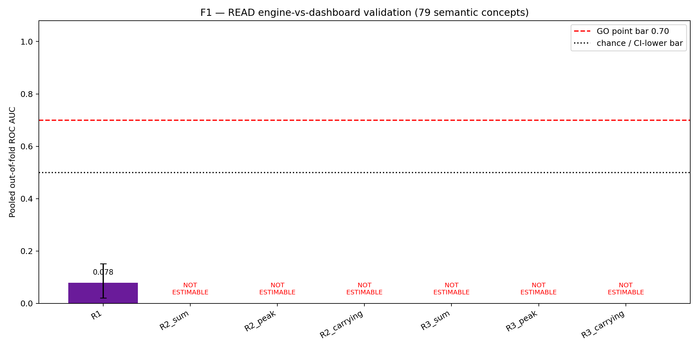
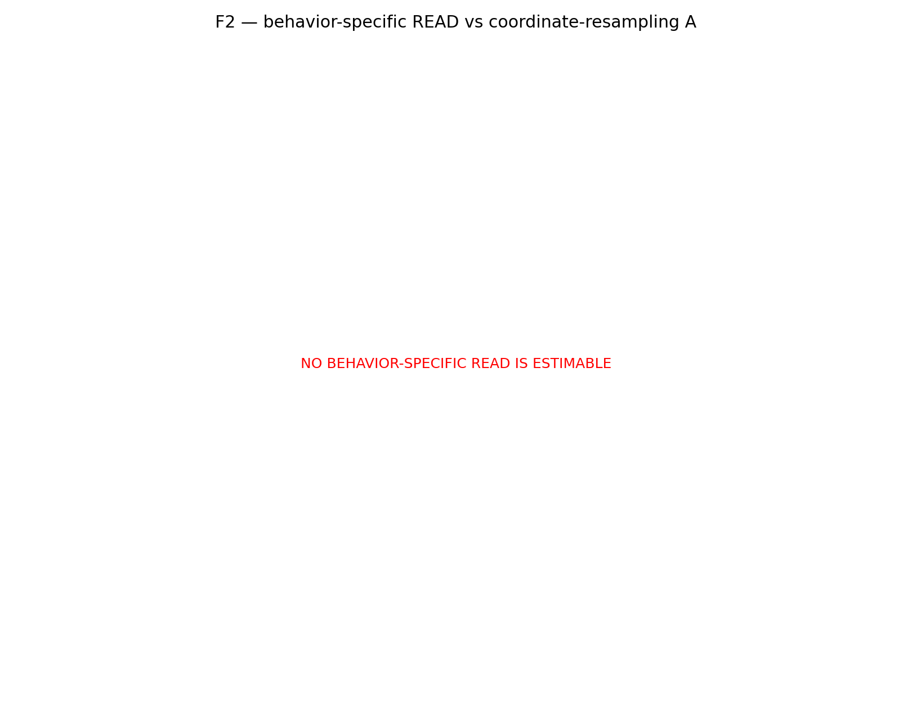

# Symmetric causal READ — preregistration (2026-07-08)

## Preflight

- `hf`: `/home/jovyan/.local/bin/hf`; authenticated as `sushmanth`.
- GPU: 143771 MiB total, 143072 MiB free.
- Hugging Face cache filesystem: 100 GiB total, 64 GiB used, 37 GiB free.
- Model is pinned to `Qwen/Qwen2.5-7B-Instruct` revision
  `a09a35458c702b33eeacc393d103063234e8bc28` in bfloat16.
- The required 20-prompt HF/J-Lens-wrapper agreement gate is KL < 1e-3.

## Pre-registered trust bar

This section was written before any new matched-interchange or gradient outcome
was computed.

- Seed: 1729. Candidate data are the 118 deterministic one-to-one reciprocal
  pairs in `data/specs/twohop_supplement.json`; every pair has two natural
  prompts and two different single-token answers. The shuffled first 24 pairs
  are calibration-only and are excluded from the trust check. All remaining
  pairs are held-out evaluation concepts.
- Position is fixed to the final prompt token. On calibration-only clean runs,
  select one J-Lens source layer from L13--L27 by maximum own-versus-matched-foil
  discrimination rate, then median margin, then lower layer. Select the WRITTEN
  threshold by maximum balanced accuracy between calibration own-concept and
  matched-foil scores, restricted to thresholds with own-concept recall >=0.80;
  ties prefer higher recall and then the lower threshold.
- A pair enters evaluation only when both engine prompts have the declared
  target as clean top-1 and both own-concept scores clear the frozen WRITTEN
  threshold. Its task-matched dashboard control additionally requires top-1
  arithmetic answers and the same WRITTEN check in both same-context controls.
  Failures remain `UNVERIFIED` with reasons and are never relabelled.
- Primary causal truth is one-position, one-layer full-residual interchange in
  both directions. Engine `T = M_A - M_B`, with
  `M = logit(answer_A) - logit(answer_B)`. Signed directional responses and
  `C = (R_A<-B + R_B<-A)/2` are not clipped. Dashboard controls use
  `M_dash = logit(4) - logit(5)` and the matched engine `T` as the fixed response
  scale because both dashboard prompts correctly retain answer 4. A separately
  labelled two-direction J-Lens two-concept-subspace interchange is diagnostic.
- Primary `READ_IG` is the mean absolute two-direction, 16-midpoint integrated
  gradient of the task metric. Its direction-defined path rotates the clean
  own-concept amount into the matched concept:
  `Delta_A = (h_A^T v_A)(v_B-v_A)` and symmetrically for B. It uses only clean
  activations, directions, forward passes, and gradients. It cannot read the
  causal artifact or import/call interchange code. `READ_local` is the mean of
  `|(h^T v)(grad_h M . v)|` over the two clean directions. Static MLP gain is a
  labelled known-broken capacity baseline and cannot trigger GO.
- Evaluation is pooled out-of-fold over five deterministic concept-pair folds;
  no estimator, sign, layer, threshold, or score transformation is selected on
  evaluation concepts. ROC bootstrap resamples concept pairs (keeping each
  engine/dashboard pair together), 10,000 draws, seed 1729.
- **GO requires primary READ_IG held-out ROC AUC >= 0.70 and the pair-bootstrap
  95% CI lower bound > 0.50.** Otherwise the decision is NO-GO. `READ_local`,
  the capacity baseline, fold AUCs, and Spearman rho with `|C|` are secondary
  and cannot rescue a failed primary.
- Sharp directional disagreement is pre-flagged at
  `|R_A<-B - R_B<-A| > 0.50`. Negative and >1 responses are retained.

## New-run status

PENDING — no symmetric-interchange or cheap-READ result has been computed yet.

---

# Prior READ Go/No-Go validation (archived, superseded by the run above)

## DECISION

**READ NO-GO: no complete-coverage candidate reaches AUC >= 0.70 with the 95% bootstrap CI lower bound strictly above 0.50.**

This is a READ-method validation result only. Written-vs-Read P1/P2/P3 remain **NOT TESTED**.

## Preflight and model scope

- GPU: NVIDIA H200; 143771 MiB total, 143072 MiB free.
- HF filesystem free: 38 GiB.
- Model: `Qwen/Qwen2.5-7B-Instruct`, bf16.
- Qwen3 scale arm: **SKIPPED** because no comparable validated Qwen3 J-Lens/direction instrument exists; 32B/30B also exceed disk and 4-bit cannot run the derivative protocol.

## Ground truth

Primary A is concept-coordinate resampling from a frozen clean donor. It is independent of READ weights/gradients but depends on the frozen J-Lens direction; it is not full-residual patching. Secondary B is the fixed masked source-to-foil clamped swap at alpha=1.5; it is not a source-only deletion.

- A defined: 155/163; B defined: 161/163. Undefined values were retained as missing.
- A/B finite paired case-level correlation: Spearman rho=0.4101667482090183; Pearson r=0.33548809947421065 (N=155).
- Strict all-79-concept A/B correlation status: `UNDEFINED_INCOMPLETE_CONCEPT_COVERAGE` because A or B is missing for 8 concepts; no pairwise-deleted concept statistic was substituted.

Declared-label verification: **FAILED_DECLARED_LABEL_COVERAGE**; failures=49/163, all engines. Failure-reason counts={'B_EDITED_TOP_NOT_COUNTERFACTUAL_TARGET': 46, 'CLEAN_TOP_NOT_DECLARED_TARGET': 6} (reasons overlap). Failures were retained. Clean capability was diagnostic only.

## Held-out classification

Inference uses 79 semantic concepts (75 engines, 4 dashboard languages), not 163 independent concepts. Four grouped folds keep source/foil connected components and each language together. R2/R3 paths and R2 position profiles use training folds only; OOF scores use unlabeled training-concept CDF calibration.

| candidate | status | OOF AUC | cluster-bootstrap 95% CI | complete coverage | GO bar |
| --- | --- | ---: | --- | --- | --- |
| R1 | OK | 0.07833333333333332 | [0.02142857142857143, 0.15203244109494102] | True | False |
| R2_sum | UNDEFINED_INCOMPLETE_CONCEPT_COVERAGE | None | [None, None] | False | False |
| R2_peak | UNDEFINED_INCOMPLETE_CONCEPT_COVERAGE | None | [None, None] | False | False |
| R2_carrying | UNDEFINED_INCOMPLETE_CONCEPT_COVERAGE | None | [None, None] | False | False |
| R3_sum | UNDEFINED_INCOMPLETE_CONCEPT_COVERAGE | None | [None, None] | False | False |
| R3_peak | UNDEFINED_INCOMPLETE_CONCEPT_COVERAGE | None | [None, None] | False | False |
| R3_carrying | UNDEFINED_INCOMPLETE_CONCEPT_COVERAGE | None | [None, None] | False | False |

The requested A-vs-B AUC rows are numerically identical because the fixed engine/dashboard labels—not causal magnitudes—define ROC AUC. They are one inferential look, not two chances to pass. Spearman associations against continuous A and B are retained in `metrics.json`.

R1 is complete but strongly ranks in the wrong direction (AUC=0.07833333333333332; a post-hoc sign flip was not permitted). Every fold still selected a non-empty top-8 R2/R3 path and all 163 R3 derivative profiles completed. However, each training split contained 5–8 structurally unavailable A localizations. Under the preregistered complete-training-coverage rule, all six R2/R3 summary scores are non-estimable for the decision; none was converted to zero or another favorable value.

## Estimators

- R1: global repaired-weight READ across every MLP/head in the compute-bounded common L25–27 frontier.
- R2: fixed train-fold top-8 path (2 MLP + 6 heads), with static sum and train-derived relative-position peak/carrying summaries.
- R3: exact input-dependent real-activation derivative on that same train-fold path, with position-normalized sum, peak, and carrying mean.

No estimator beyond R1/R2/R3 was added; no alpha sweep, controls, nulls, capability run, ambiguity, scale science, P1/P2/P3, tests, or lint were run.

## Limitations

- Only four independent dashboard concepts exist; the 10,000-draw CI resamples dependency clusters and is intrinsically fragile.
- Engine and dashboard labels are task/domain-confounded (two-hop facts versus multilingual continuation).
- The roster is reused calibration data, not an untouched external holdout.
- A uses direction-coordinate rather than full-state resampling because the repository has no matched clean/corrupt prompt pairs.
- Frozen donor activations are an exogenous corruption bank and may cross evaluation folds; donor folds are never used as labels or path-selection observations, but dependence remains.
- L25–27 is a compute-bounded common frontier, not all downstream components.

## Reproducibility

- Protocol SHA-256: `06e8ecf624b1aae7060426fbbc17429e60809caf9e24ed53b79dfb6ae8190d31`.
- Notebook-20 raw: `/home/jovyan/j-space-thoughts/data/raw/v5/20_read_ground_truth.json` (`f7e780f9584ab951b8bd54a70eb0fa09019f40d0125d6b4ecaffe697a64a99bc`).
- Notebook-21 raw: `/home/jovyan/j-space-thoughts/data/raw/v5/21_read_estimators.json` (`4dff5273330f0d6b2f9c59fe26478fc2d1ea938564535ac04cc13424194c02e7`).
- Notebook-22 raw: `/home/jovyan/j-space-thoughts/data/raw/v5/22_read_decision.json` (`87410bb9437965ea92908039e6784b4cc1eb582409bd43378acf1d123d646319`).
