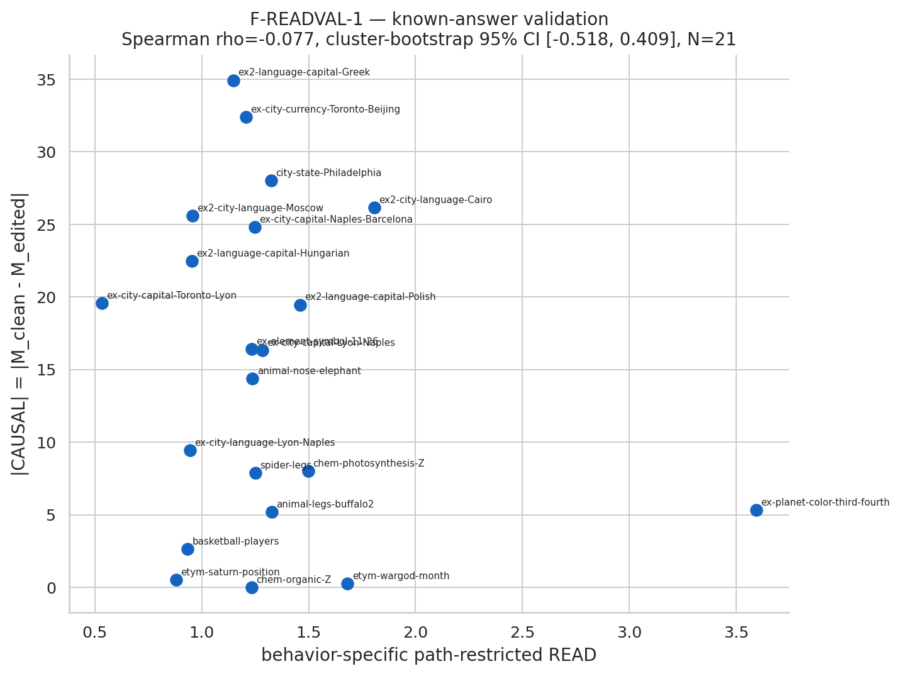
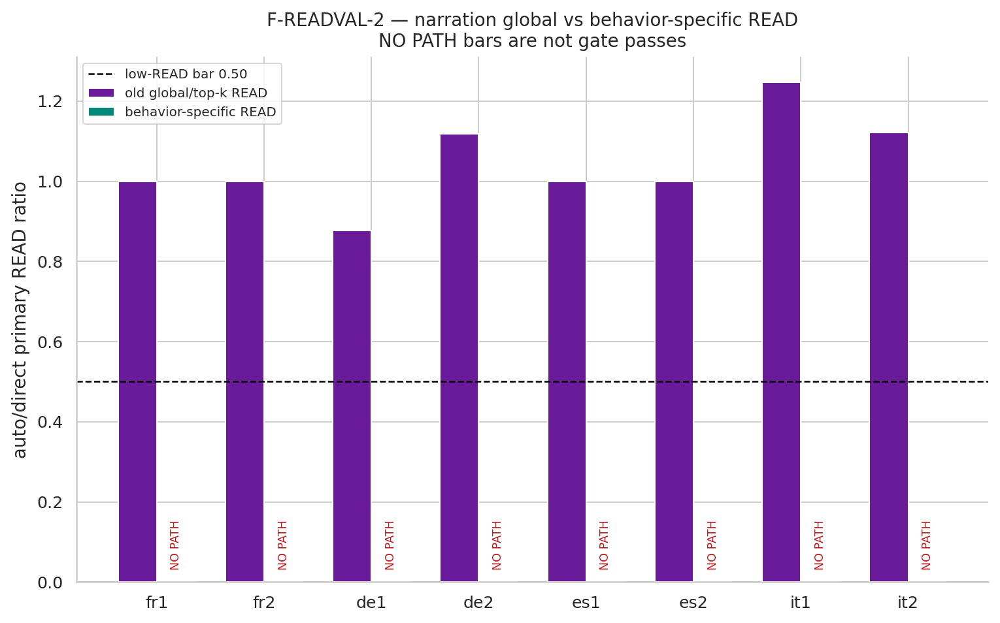

# Behavior-specific READ validation report (v4)

## Current status

**ONE ESTIMATOR EXECUTED; G-READVAL PENDING. SCIENCE PROHIBITED.**

## Preflight and fixed protocol

- GPU: NVIDIA H200; total VRAM 143771 MiB; free 143072 MiB.
- Home/HF filesystem free: 37.9 GiB.
- Model: `Qwen/Qwen2.5-7B-Instruct` at `a09a35458c702b33eeacc393d103063234e8bc28` in `torch.bfloat16`.
- HF/J-Lens max mean KL: 1.660e-08 (N=20, threshold 1e-3): **PASS**.
- New READ estimators added: **1**. No alpha resweep was run.
- Locked known-answer roster: N=21 (prior v2 20 plus spider).
- Fixed causal endpoint: masked fractional source-to-foil swap, alpha=1.5, L13-24.
- Path discovery: source-only unit deletion at a clean minimum-rank layer.
- Exact path threshold: `|patched delta M| >= 0.05`; no top-k/fallback.
- Clean-to-clean maximum component patch: 0.000e+00.
- Raw artifact: `data/raw/v4/10_behavior_specific_read.json` (SHA-256 `77f129bf5f5366815e51819185f621e950e72770471b05627a605a657d06ff03`).

## Notebook 10 — path-restricted READ built

- Known-answer estimable rows: 21/21.
- Known-answer |S_M| range: 2–153.
- Narration auto |S_M| range: 0–0.
- Narration direct |S_M| range: 21–204.

Notebook 11 must now apply the frozen G-READVAL bars. No hypothesis science has run.
## Notebook 11 — G-READVAL

### (a) Known-answer predictivity

- Status: **FAIL**.
- N=21 across 19 source-concept clusters.
- Spearman rho=-0.077; source-cluster bootstrap 95% CI [-0.518, 0.409] (5000/5000 valid draws).
- Frozen bar: rho>=0.4 and CI lower>0, with every locked row estimable.

| item | |CAUSAL| | behavior-specific READ | old global READ | |S_M| | estimable |
| --- | ---: | ---: | ---: | ---: | --- |
| spider-legs | 7.875 | 1.250 | 1.391 | 36 | YES |
| animal-legs-buffalo2 | 5.188 | 1.328 | 1.912 | 116 | YES |
| chem-photosynthesis-Z | 8.000 | 1.498 | 2.104 | 58 | YES |
| animal-nose-elephant | 14.375 | 1.237 | 1.339 | 51 | YES |
| basketball-players | 2.625 | 0.934 | 0.675 | 56 | YES |
| chem-organic-Z | 0.000 | 1.233 | 1.764 | 44 | YES |
| city-state-Philadelphia | 28.031 | 1.325 | 2.534 | 145 | YES |
| etym-saturn-position | 0.500 | 0.880 | 1.379 | 17 | YES |
| etym-wargod-month | 0.250 | 1.682 | 1.863 | 12 | YES |
| ex-city-capital-Lyon-Naples | 16.312 | 1.283 | 1.907 | 39 | YES |
| ex-city-capital-Naples-Barcelona | 24.812 | 1.248 | 2.405 | 50 | YES |
| ex-city-capital-Toronto-Lyon | 19.562 | 0.533 | 2.010 | 78 | YES |
| ex-city-currency-Toronto-Beijing | 32.406 | 1.207 | 2.296 | 43 | YES |
| ex-city-language-Lyon-Naples | 9.438 | 0.945 | 1.634 | 112 | YES |
| ex-element-symbol-11-26 | 16.406 | 1.233 | 1.584 | 32 | YES |
| ex-planet-color-third-fourth | 5.312 | 3.593 | 2.052 | 2 | YES |
| ex2-city-language-Cairo | 26.156 | 1.806 | 2.897 | 104 | YES |
| ex2-city-language-Moscow | 25.594 | 0.957 | 1.685 | 45 | YES |
| ex2-language-capital-Greek | 34.938 | 1.147 | 2.758 | 48 | YES |
| ex2-language-capital-Hungarian | 22.484 | 0.954 | 1.517 | 153 | YES |
| ex2-language-capital-Polish | 19.469 | 1.459 | 2.226 | 116 | YES |

### (b) Narration separation

- Status: **FAIL**.
- Joint low-READ/low-CAUSAL/clean-capable: 0/8 across 0 languages.
- Finite behavior-specific ratios: 0/8. Empty auto path sets are `NO_AUTO_PATH_DETECTED`, not low-READ passes.

| item | language | frozen v3 global | recomputed global | behavior-specific | |S_auto| | |S_direct| | |CAUSAL| | joint |
| --- | --- | ---: | ---: | ---: | ---: | ---: | ---: | --- |
| fr1 | French | 0.849 | 1.000 | NA | 0 | 179 | 0.214 | FAIL |
| fr2 | French | 1.000 | 1.000 | NA | 0 | 182 | 0.167 | FAIL |
| de1 | German | 1.000 | 0.876 | NA | 0 | 21 | 0.000 | FAIL |
| de2 | German | 1.118 | 1.118 | NA | 0 | 73 | 0.018 | FAIL |
| es1 | Spanish | 1.000 | 1.000 | NA | 0 | 73 | 0.002 | FAIL |
| es2 | Spanish | 1.000 | 1.000 | NA | 0 | 93 | 0.059 | FAIL |
| it1 | Italian | 1.247 | 1.247 | NA | 0 | 204 | 0.131 | FAIL |
| it2 | Italian | 1.121 | 1.121 | NA | 0 | 198 | 0.028 | FAIL |

### Decision

**G-READVAL FAIL.** Both subgates were required. Stage A science is prohibited; the workflow must stop estimator work and take Road B.

The new estimator is selection-conditioned on exact path patching for the same behavior metric, but path discovery used a distinct source-only deletion rather than the causal swap endpoint. No threshold or alpha was tuned after outcomes.

Raw gate artifact: `data/raw/v4/11_readval_gate.json` (SHA-256 `abcf605278a4c9b82643e093038ecb3c06455310db34d692dd84bb9c67ab3360`).
## Notebook 12 — P1/P2 two-hop and narration science

**SKIPPED_PREREQUISITE.** G-READVAL failed. This notebook executed a model-free
guard; no hypothesis science or historical science values were run.
## Notebook 13 — P3 ambiguity science

**SKIPPED_PREREQUISITE.** G-READVAL failed. This notebook executed a model-free
guard; no hypothesis science or historical science values were run.
