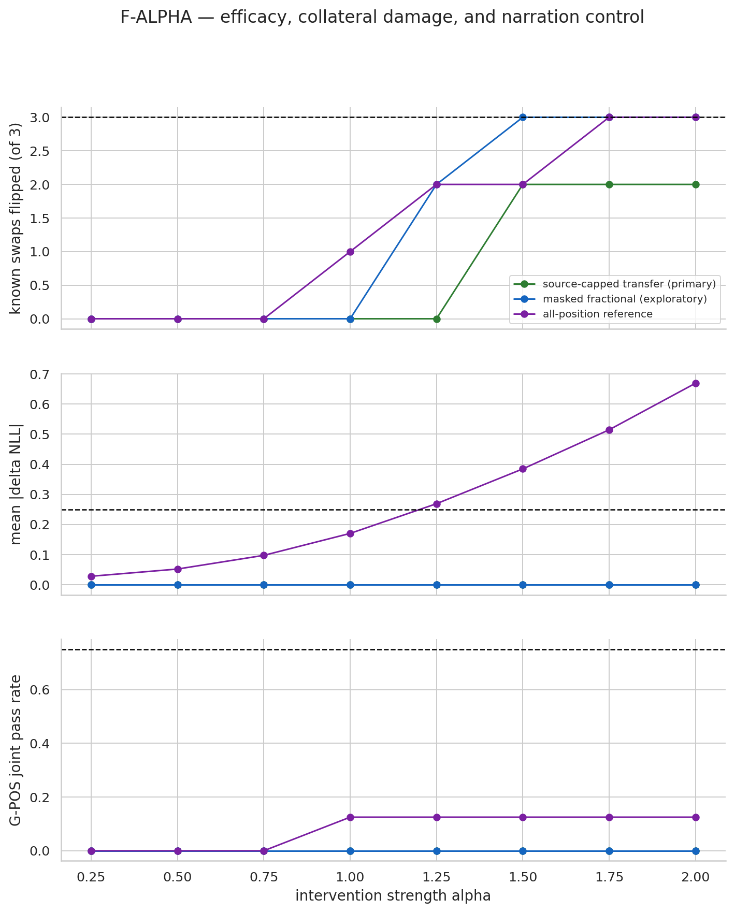

# Surgical intervention calibration report (v3)

## Current verdict

**G-ALPHA FAILED; STAGE 2 AND STAGE 3 SKIPPED.** Stage 4 is required. This is a calibration limitation, not a hypothesis verdict.

## Environment

- GPU: NVIDIA H200; 143771 MiB total; 143072 MiB free at preflight.
- Home/HF-cache filesystem: 100.0 GiB total; 38.1 GiB free.
- Required tool/auth preflight: **PASS**.
- Model: `Qwen/Qwen2.5-7B-Instruct` at `a09a35458c702b33eeacc393d103063234e8bc28` in `torch.bfloat16`.

## Stage 0 — v2 instrument re-verification

- HF/J-Lens logit gate: **PASS**; max mean KL=1.660e-08, N=20.
- Known-answer alpha-2 swaps: **PASS** (3/3).
- Cached held-out G-DIR artifact: **PASS**; retrieval top-1=0.550, known-answer top-5=0.8875.
- Non-structural direct suppression controls: **PASS**.

Stage-0 decision: **PASS**. This licenses only G-SWAP confirmation
and the alpha sweep; it does not license Stage-2 recalibration or Stage-3 science.

## Stage 1 — G-SWAP confirmation

| item | concept swap | clean top-1 | edited top-1 | clean M | edited M | gate |
| --- | --- | --- | --- | ---: | ---: | --- |
| spider-legs | ` spider` -> `ant` | `8` | `6` | 6.500 | -6.500 | PASS |
| animal-legs-buffalo2 | ` buffalo` -> ` spider` | ` four` | ` eight` | 3.562 | -4.000 | PASS |
| chem-photosynthesis-Z | ` oxygen` -> ` nitrogen` | `8` | `7` | 5.375 | -5.250 | PASS |

**G-SWAP PASS (3/3).**
The next permitted step is the surgical alpha sweep. Science remains prohibited.

## Stage 1.5 — surgical alpha sweep

The carrying mask was frozen from clean source-label J-Lens rank <=10 at any
workspace layer before edited forwards. The source-capped operator was primary.
The carrying-position fractional swap is reported as an exploratory,
nonselectable sensitivity analysis because it was not frozen in notebook 00.
The all-position fractional swap is diagnostic only.

| policy | alpha | swaps | mean delta NLL | mean abs delta NLL | G-POS | random | absent | composite |
| --- | ---: | ---: | ---: | ---: | ---: | --- | --- | --- |
| project_out_transfer | 0.25 | 0/3 | +0.000 | 0.000 | 0/8 | FAIL | FAIL | FAIL |
| project_out_transfer | 0.50 | 0/3 | +0.000 | 0.000 | 0/8 | PASS | PASS | FAIL |
| project_out_transfer | 0.75 | 0/3 | +0.000 | 0.000 | 0/8 | PASS | FAIL | FAIL |
| project_out_transfer | 1.00 | 0/3 | +0.000 | 0.000 | 0/8 | PASS | FAIL | FAIL |
| project_out_transfer | 1.25 | 0/3 | +0.000 | 0.000 | 0/8 | PASS | FAIL | FAIL |
| project_out_transfer | 1.50 | 2/3 | +0.000 | 0.000 | 0/8 | PASS | FAIL | FAIL |
| project_out_transfer | 1.75 | 2/3 | +0.000 | 0.000 | 0/8 | PASS | FAIL | FAIL |
| project_out_transfer | 2.00 | 2/3 | +0.000 | 0.000 | 0/8 | PASS | FAIL | FAIL |
| fractional_swap_carrying_positions | 0.25 | 0/3 | +0.000 | 0.000 | 0/8 | PASS | FAIL | FAIL |
| fractional_swap_carrying_positions | 0.50 | 0/3 | +0.000 | 0.000 | 0/8 | PASS | FAIL | FAIL |
| fractional_swap_carrying_positions | 0.75 | 0/3 | +0.000 | 0.000 | 0/8 | FAIL | FAIL | FAIL |
| fractional_swap_carrying_positions | 1.00 | 0/3 | +0.000 | 0.000 | 0/8 | PASS | FAIL | FAIL |
| fractional_swap_carrying_positions | 1.25 | 2/3 | +0.000 | 0.000 | 0/8 | PASS | PASS | FAIL |
| fractional_swap_carrying_positions | 1.50 | 3/3 | +0.000 | 0.000 | 0/8 | PASS | PASS | FAIL |
| fractional_swap_carrying_positions | 1.75 | 3/3 | +0.000 | 0.000 | 0/8 | PASS | PASS | FAIL |
| fractional_swap_carrying_positions | 2.00 | 3/3 | +0.000 | 0.000 | 0/8 | PASS | PASS | FAIL |
| fractional_swap_all_positions_reference | 0.25 | 0/3 | -0.004 | 0.028 | 0/8 | FAIL | FAIL | FAIL |
| fractional_swap_all_positions_reference | 0.50 | 0/3 | +0.021 | 0.052 | 0/8 | FAIL | FAIL | FAIL |
| fractional_swap_all_positions_reference | 0.75 | 0/3 | +0.057 | 0.098 | 0/8 | FAIL | FAIL | FAIL |
| fractional_swap_all_positions_reference | 1.00 | 1/3 | +0.124 | 0.170 | 1/8 | FAIL | FAIL | FAIL |
| fractional_swap_all_positions_reference | 1.25 | 2/3 | +0.230 | 0.269 | 1/8 | PASS | PASS | FAIL |
| fractional_swap_all_positions_reference | 1.50 | 2/3 | +0.344 | 0.385 | 1/8 | PASS | PASS | FAIL |
| fractional_swap_all_positions_reference | 1.75 | 3/3 | +0.474 | 0.515 | 1/8 | PASS | PASS | FAIL |
| fractional_swap_all_positions_reference | 2.00 | 3/3 | +0.623 | 0.669 | 1/8 | PASS | PASS | FAIL |

### What the sweep isolated

The strongest exploratory surgical candidate was the carrying-position
fractional swap at alpha=1.50: swaps **3/3**, random and absent nulls **PASS**,
and mean capability delta NLL=0.000. That capability number
is a conditional no-op result, not broad evidence of harmlessness:
**24/24 unrelated-text masks were
empty**, so the frozen rank rule applied no edit on every capability item.

The same alpha=1.50 candidate had small narration internal changes on all eight
items (largest absolute delta=0.215) and its direct firing
controls passed, but G-POS reproduced **0/8**. Every mask-specific primary
weight-READ ratio exceeded the required <=0.50 threshold:

| item | internal delta | weight-READ ratio | <=0.50 |
| --- | ---: | ---: | --- |
| fr1 | -0.215 | 0.849 | FAIL |
| fr2 | -0.159 | 1.000 | FAIL |
| de1 | +0.009 | 1.000 | FAIL |
| de2 | +0.025 | 1.118 | FAIL |
| es1 | +0.002 | 1.000 | FAIL |
| es2 | -0.059 | 1.000 | FAIL |
| it1 | -0.120 | 1.247 | FAIL |
| it2 | -0.032 | 1.121 | FAIL |

Subgate decomposition at this setting: clean continuation capable
**7/8**; high WRITE
**8/8**; direct source-to-English flip
**8/8**; low absolute causal change
**8/8**; low causal change relative to the
direct arm **8/8**; low primary
weight-READ **0/8**; and both
firing-control checks **8/8**.

These weight-READ ratios are properties of the fixed masks and are invariant to
alpha. Increasing or decreasing intervention strength therefore cannot make
this candidate satisfy the low-READ premise. `es2` additionally failed the
clean-continuation-capable prerequisite.

For context, the all-position reference at alpha=1.25 had signed grand mean
delta NLL=0.230, but its grand mean absolute delta
NLL=0.269 exceeded 0.25 and its per-intervention
signed means also failed (animal-legs-buffalo2=0.263, chem-photosynthesis-Z=0.074, spider-legs=0.354). It was nonselectable by protocol.

The full 24-row random and absent-control sweep is stored at
`data/raw/v3/015_alpha_sweep.json` (SHA-256 `a46e047a3f47908bb9d74cc0758aedfb5fcc66505aa676dcfb6f43e258149d67`).

**G-ALPHA FAIL; no tested strength/policy simultaneously achieved 3/3 swaps, capability, G-POS, and both specificity nulls.** The frozen primary policy never exceeded 2/3 swaps. The
exploratory carrying-position rescue also failed G-POS, so making it selectable
would not alter the decision. Stage 2 and Stage 3 are skipped; the workflow
takes the calibration-limitation fallback without a hypothesis verdict.

## Stage 2 — recalibration at alpha*

**SKIPPED_PREREQUISITE.** No alpha* exists, so no alpha*-specific recalibration is defined. No model forward was run in notebook
04. The following alpha*-specific checks therefore remain unmeasured:

- G-DIR at alpha*: **NOT_EVALUATED_NO_ALPHA**
- G-POS at alpha*: **NOT_EVALUATED_NO_ALPHA**
- G-SWAP at alpha*: **NOT_EVALUATED_NO_ALPHA**
- capability at alpha*: **NOT_EVALUATED_NO_ALPHA**
- weight-READ validation at alpha*: **NOT_EVALUATED_NO_ALPHA**

Stage-0 G-DIR re-verification is retained as an instrument sentinel, but it is
not relabeled as a Stage-2 result at a nonexistent alpha*.

## Stage 3 — science prerequisite records

| notebook | preregistered scope | result |
| --- | --- | --- |
| 05_science_twohop.ipynb | P1 and P2 | SKIPPED_PREREQUISITE |

These notebooks are executed model-free guards. They do not import historical
science values or treat missing measurements as negative effects.
