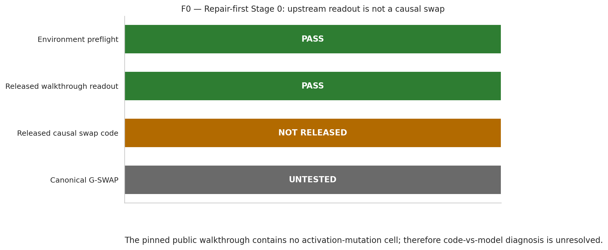
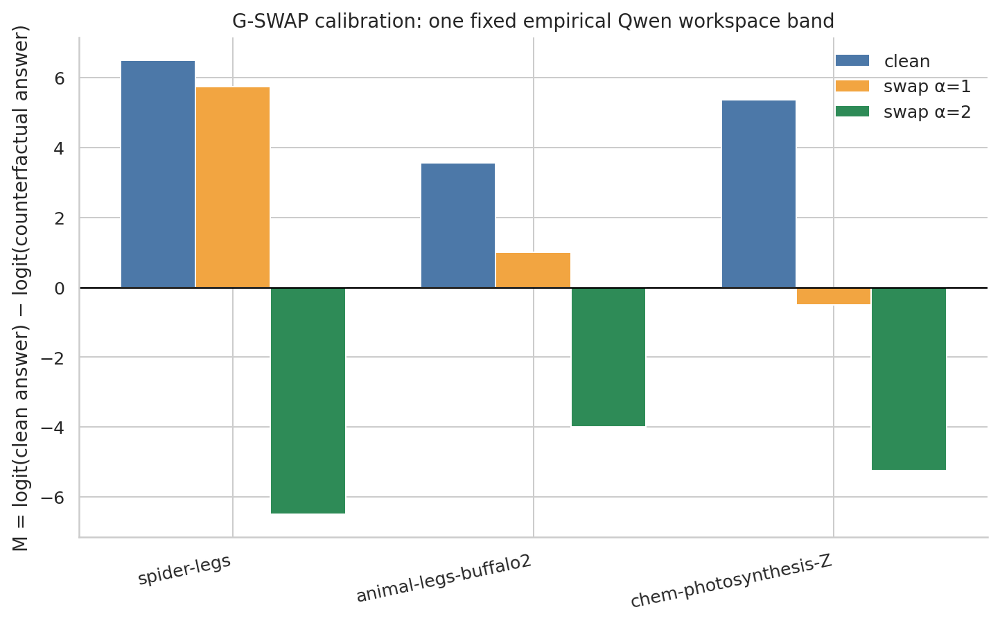
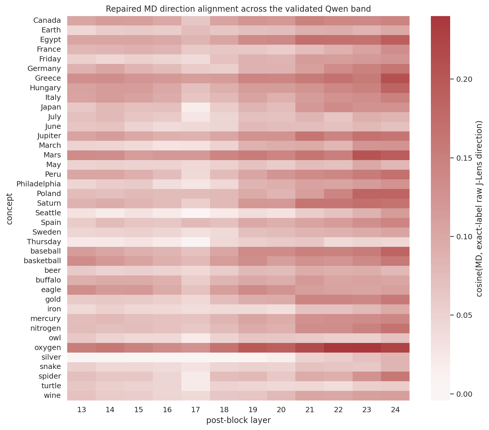

# Repair-first replication report (v2)

## Current verdict

**G-SWAP PASS; SCIENCE NOT YET RUN.** The causal swap
instrument now passes the three-case known-answer calibration, but the v2
hypothesis remains undecided until G-DIR, READ validation, firing controls, and
G-POS are completed. The v1 `NOT SUPPORTED` / `REFUTED` labels remain withdrawn
as scientific conclusions.

## Environment

- GPU: NVIDIA H200; 143771 MiB total; 143072 MiB free at recorded preflight.
- Home/HF-cache filesystem: 100.0 GiB total; 38.1 GiB free at recorded notebook preflight.
- Required tool/auth preflight: **PASS**.

## Stage 0 — upstream diagnosis

- Released walkthrough readout: **PASS** on `Qwen/Qwen3.5-4B`.
- Released executable causal swap: **NOT RUNNABLE**; the public walkthrough is readout-only.
- Decision: `UPSTREAM_CAUSAL_SWAP_NOT_RUNNABLE_RELEASE_OMISSION`. This omission does not establish a Qwen model mismatch.

## Stage 1a — repaired known-answer swap

The configuration was frozen before testing swap outcomes. The paper's
approximately 38–92% workspace-depth prior maps to layers
`[11, 12, 13, 14, 15, 16, 17, 18, 19, 20, 21, 22, 23, 24]`. Within it, the longest contiguous run where
the median clean source-concept J-Lens rank across three prompts is top-10 is
**layers 13–24**.

The repaired convention is: exact upstream JSON label when it is one token
(notably `ant` id 517), paper-literal raw `J.T @ W_U`, all prompt positions,
and the paper's documented double-strength swap (`alpha=2`).

| item | concept swap | clean top-1 | edited top-1 | clean M | edited M | min source rank | gate |
| --- | --- | --- | --- | ---: | ---: | ---: | --- |
| spider-legs | ` spider`→`ant` | `8` | `6` | 6.500 | -6.500 | 1 | PASS |
| animal-legs-buffalo2 | ` buffalo`→` spider` | ` four` | ` eight` | 3.562 | -4.000 | 1 | PASS |
| chem-photosynthesis-Z | ` oxygen`→` nitrogen` | `8` | `7` | 5.375 | -5.250 | 2 | PASS |

`M = logit(clean answer) - logit(counterfactual answer)`. All canonical runs
were repeated three times with identical logits/top-1 results. The alpha-zero
clean-clamp maximum logit error was
`0`.

### G-SWAP decision

**PASS (3/3).**
This licenses only the next repair/calibration notebooks. It does not license
P1–P3 or a claim about the WRITE-versus-READ hypothesis.

Important limits: the leading-space ` ant` token can have better clean readout
rank on matched cues, reverse ant→spider did not flip 6→8, and alpha=2 is a
stronger intervention than an unscaled coordinate exchange. Those facts are
persisted rather than hidden.

## Gate ledger

| gate | status | consequence |
| --- | --- | --- |
| Stage-0 preflight | PASS | Environment usable |
| Upstream causal swap | NOT RUNNABLE | Release omission |
| G1 HF/J-Lens logits | PASS | max mean KL=1.660e-08, N=20 |
| G-SWAP | PASS | Proceed to G-DIR and READ validation only |
| G-DIR | NOT RUN IN V2 | Notebook 02 next |
| READ validation | NOT RUN IN V2 | Notebook 03 pending |
| G-POS / firing controls | NOT RUN IN V2 | Stage 2 pending |
| Stage-3 science | PROHIBITED | Calibration chain incomplete |

## Stage 1c — independent concept finder (G-DIR)

The old analysis fixed validation at L18 and sampled the final common
instruction token; its 40-way held-out top-1 was 0.0625. Within the repaired
L13–L24 band, v2
selects **cue_last4 at
L24** by leave-one-training-template-out
retrieval. No held-out MD result entered that selection.

- Held-out retrieval: **0.550** (44/80); 95% Wilson CI [0.441, 0.654]; chance=0.025.
- Exact-token held-out known-answer top-5: **0.887**; top-1=0.525; N=80.
- Explicit wording `question_one_word` was selected using training cues only.
- cosine(MD, exact-label raw J-Lens) at L24: **0.132** (95% CI [0.118, 0.145], N=40). Alignment is reported, not required to be high.

| criterion | result |
| --- | --- |
| retrieval_estimate_at_least_4x_chance | PASS |
| retrieval_ci_above_chance | PASS |
| retrieval_permutation_p_below_0.01 | PASS |
| retrieval_auroc_ci_above_half | PASS |
| known_answer_top5_at_least_0.80 | PASS |
| heldout_sign_fraction_at_least_0.80 | PASS |
| stability_median_at_least_0.70 | PASS |
| silent_top10_at_most_0.25 | PASS |
| unit_norm_within_1e-5 | PASS |

### G-DIR decision

**PASS**. The MD arm is validated for later robustness checks.

Stage-3 science remains prohibited pending READ validation, firing controls,
and G-POS.
