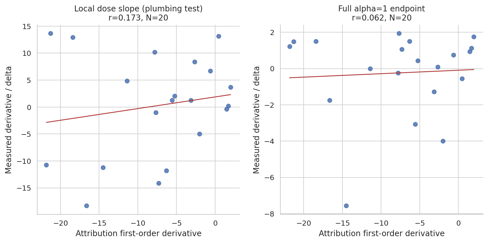
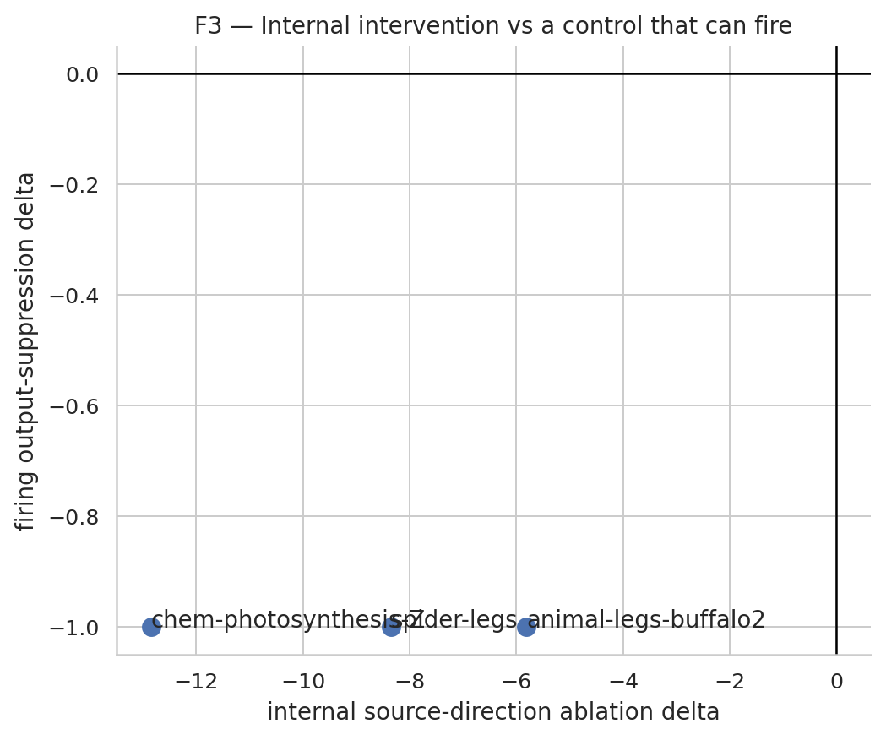

# Repair-first replication report (v2)

## Current verdict

**STAGE-2 CALIBRATION FAIL; STAGE-3 SCIENCE SKIPPED.** G-SWAP, G-DIR, repaired
READ validation, firing controls, and the matched random/absent specificity
checks pass. Capability preservation fails and G-POS reproduces only 1/8
passages. The Stage-4 replication-failure deliverable is complete. The
WRITE-versus-READ hypothesis remains untested; the v1 `NOT
SUPPORTED` / `REFUTED` labels remain withdrawn as scientific conclusions.

## Environment

- GPU: NVIDIA H200; 143771 MiB total; 143072 MiB free at recorded preflight.
- Home/HF-cache filesystem: 100.0 GiB total; 38.1 GiB free at recorded notebook preflight.
- Required tool/auth preflight: **PASS**.

## Stage 0 — upstream diagnosis

- Released walkthrough readout: **PASS** on `Qwen/Qwen3.5-4B`.
- Released executable causal swap: **NOT RUNNABLE**; the public walkthrough is readout-only.
- Decision: `UPSTREAM_CAUSAL_SWAP_NOT_RUNNABLE_RELEASE_OMISSION`. This omission does not establish a Qwen model mismatch.

## Stage 1a — repaired known-answer swap

The configuration was frozen before testing swap outcomes. The paper's
approximately 38–92% workspace-depth prior maps to layers
`[11, 12, 13, 14, 15, 16, 17, 18, 19, 20, 21, 22, 23, 24]`. Within it, the longest contiguous run where
the median clean source-concept J-Lens rank across three prompts is top-10 is
**layers 13–24**.

The repaired convention is: exact upstream JSON label when it is one token
(notably `ant` id 517), paper-literal raw `J.T @ W_U`, all prompt positions,
and the paper's documented double-strength swap (`alpha=2`).

| item | concept swap | clean top-1 | edited top-1 | clean M | edited M | min source rank | gate |
| --- | --- | --- | --- | ---: | ---: | ---: | --- |
| spider-legs | ` spider`→`ant` | `8` | `6` | 6.500 | -6.500 | 1 | PASS |
| animal-legs-buffalo2 | ` buffalo`→` spider` | ` four` | ` eight` | 3.562 | -4.000 | 1 | PASS |
| chem-photosynthesis-Z | ` oxygen`→` nitrogen` | `8` | `7` | 5.375 | -5.250 | 2 | PASS |

`M = logit(clean answer) - logit(counterfactual answer)`. All canonical runs
were repeated three times with identical logits/top-1 results. The alpha-zero
clean-clamp maximum logit error was
`0`.

### G-SWAP decision

**PASS (3/3).**
This licenses only the next repair/calibration notebooks. It does not license
P1–P3 or a claim about the WRITE-versus-READ hypothesis.

Important limits: the leading-space ` ant` token can have better clean readout
rank on matched cues, reverse ant→spider did not flip 6→8, and alpha=2 is a
stronger intervention than an unscaled coordinate exchange. Those facts are
persisted rather than hidden.

## Gate ledger

| gate | status | consequence |
| --- | --- | --- |
| Stage-0 preflight | PASS | Environment usable |
| Upstream causal swap | NOT RUNNABLE | Release omission |
| G1 HF/J-Lens logits | PASS | max mean KL=1.660e-08, N=20 |
| G-SWAP | PASS | Proceed to G-DIR and READ validation only |
| G-DIR | PASS | Independent MD direction validated |
| READ validation | PASS | Weight-based primary; attribution secondary |
| Firing controls | PASS | Redesigned metrics move by exact nonzero amounts |
| Random / absent specificity | PASS / PASS | Stage-2 specificity checks pass |
| Capability | FAIL | Mean delta NLL +0.623 on unrelated text |
| G-POS | FAIL (1/8) | Required at least 6/8 across 3 languages |
| Stage-3 science | SKIPPED PREREQUISITE | Stage-4 report required |

## Stage 1c — independent concept finder (G-DIR)

The old analysis fixed validation at L18 and sampled the final common
instruction token; its 40-way held-out top-1 was 0.0625. Within the repaired
L13–L24 band, v2
selects **cue_last4 at
L24** by leave-one-training-template-out
retrieval. No held-out MD result entered that selection.

- Held-out retrieval: **0.550** (44/80); 95% Wilson CI [0.441, 0.654]; chance=0.025.
- Exact-token held-out known-answer top-5: **0.887**; top-1=0.525; N=80.
- Explicit wording `question_one_word` was selected using training cues only.
- cosine(MD, exact-label raw J-Lens) at L24: **0.132** (95% CI [0.118, 0.145], N=40). Alignment is reported, not required to be high.

| criterion | result |
| --- | --- |
| retrieval_estimate_at_least_4x_chance | PASS |
| retrieval_ci_above_chance | PASS |
| retrieval_permutation_p_below_0.01 | PASS |
| retrieval_auroc_ci_above_half | PASS |
| known_answer_top5_at_least_0.80 | PASS |
| heldout_sign_fraction_at_least_0.80 | PASS |
| stability_median_at_least_0.70 | PASS |
| silent_top10_at_most_0.25 | PASS |
| unit_norm_within_1e-5 | PASS |

### G-DIR decision

**PASS**. The MD arm is validated for later robustness checks.

Stage-3 science remains prohibited pending READ validation, firing controls,
and G-POS.

## Stage 1d — READ repair and validation

The old `r=-0.36` label conflated two quantities: it compared the signed
first-order product `-sum(WRITE*READ)` with a large full ablation, not READ
magnitude with causal damage. V2 separates local gradient plumbing, the
nonlinear endpoint, and READ-strength association.

- Exact shared-alpha derivative check on the three G-SWAP cases: **PASS**.
- Attribution prediction vs local dose slope: r=0.173, 95% CI [-0.374, 0.701], N=20.
- Attribution prediction vs full alpha=1 ablation: r=0.062, 95% CI [-0.406, 0.482], N=20.
- Attribution READ magnitude vs positive damage: r=-0.187, 95% CI [-0.469, 0.156].
- Partial READ-magnitude association given WRITE: r=-0.009, 95% CI [-0.341, 0.301].

Weight READ now feeds block `k` with `v[k-1]` and evaluates output/label
orientation against `v[k]`; the legacy code incorrectly reused one source-layer
vector at every downstream block. Components are flagged by attribution on the
three clear calibration cases, then evaluated against 32 seeded random
directions.

- Weight calibration: **PASS**; above-random in 2/3 cases. Positive MLP+attention orientation occurs in 1/3 and is diagnostic only because weight magnitude is unsigned.
- MLP attribution/weight rank rho=0.600 (N=6).
- Attention attribution/weight rank rho=0.839 (N=12).

### READ decision

**PASS — primary READ: WEIGHT_BASED; attribution role:
SECONDARY.** Weight magnitude is unsigned; signed label orientation is a
separate diagnostic and is not mislabeled as behavioral attribution.

Stage-3 science remains prohibited until firing controls and G-POS pass.

## Stage 2 — recalibration, firing controls, and G-POS

- G-SWAP re-verification: **PASS**.
- Controls that can fire: **PASS**. Direct
  concept/language-answer suppression and both continuation arms each changed a
  metric containing the suppressed token; they are not structural zeros.
- Matched random-pair null: **PASS** (64 draws per case).
- Absent-coordinate null: **PASS**; eligible=3; median |null|/|real|=0.05232558139534884.
- Capability: **FAIL**; mean delta NLL=0.623, N=24.
- Identity-J diagnostic: 1/3 counterfactual top-1 flips, versus 3/3 for J-Lens.

### Known-narration positive control

The v2 metric was frozen before intervention outcomes: a clean greedy 16-token
rollout is teacher-forced, and normalized source-language versus English token
family mass is scored across all 16 predictions. The aligned leading-space
language-label coordinate is used for WRITE, swap, direct classification, and
suppression. Attribution is secondary and is not a G-POS gate.

| passage | language | min all-prompt WRITE rank | clean continuation M | internal delta | direct-task delta | primary weight READ ratio | attribution ratio (secondary) | joint |
| --- | --- | ---: | ---: | ---: | ---: | ---: | ---: | --- |
| fr1 | French | 1 | 2.815 | -1.180 | -30.125 | 1.000 | 0.040 | FAIL |
| fr2 | French | 1 | 2.390 | -1.037 | -28.750 | 0.517 | 0.072 | FAIL |
| de1 | German | 3 | 4.219 | -1.028 | -31.344 | 0.879 | 0.074 | FAIL |
| de2 | German | 2 | 4.177 | -0.525 | -35.375 | 0.813 | 0.093 | FAIL |
| es1 | Spanish | 4 | 2.692 | 0.054 | -30.969 | 0.400 | 0.064 | PASS |
| es2 | Spanish | 1 | -6.700 | -0.459 | -33.906 | 1.000 | 0.070 | FAIL |
| it1 | Italian | 1 | 3.117 | -0.281 | -29.562 | 1.000 | 0.070 | FAIL |
| it2 | Italian | 1 | 2.629 | -0.439 | -30.594 | 1.121 | 0.070 | FAIL |

**G-POS FAIL: 1/8 passages,
languages=['Spanish'].** The preregistered threshold is
at least 6/8 passages spanning at least 3/4 languages.

### Stage-2 decision

**FAIL**. Stage 3 is blocked; the workflow switches to the Stage-4 replication-failure report. This is not a verdict on the hypothesis.

## Stage 4 — replication-failure fallback

### Final classification

**OPEN-MODEL INSTRUMENT REPLICATION FAILURE; HYPOTHESIS NOT TESTED.** The
custom repaired swap passed 3/3 known-answer
cases and passed Stage-2 reverification, but the complete calibration chain did
not pass. Stage 3 was therefore skipped exactly as preregistered.

The released upstream walkthrough supplied J-Lens readout but omitted executable
causal-swap code (`NOT_RUNNABLE_RELEASE_OMISSION`), so the upstream intervention
could not be run unchanged. The successful 3/3 custom swap is a local repair,
not evidence that all required controls calibrated.

### Calibration blockers

| gate | status | persisted evidence |
| --- | --- | --- |
| capability preservation | FAIL | mean delta NLL=0.623; mean absolute delta NLL=0.669; threshold=0.25 |
| G-POS | FAIL | 1/8 passages; languages=Spanish |

### Science path deliberately skipped

| notebook | disposition |
| --- | --- |
| `05_science_twohop.ipynb` | SKIPPED_PREREQUISITE |
| `06_science_ambiguity.ipynb` | SKIPPED_PREREQUISITE |
| `07_scale.ipynb` | SKIPPED_PREREQUISITE |

| preregistered prediction | result |
| --- | --- |
| P1 | **NOT_TESTED** |
| P2 | **NOT_TESTED** |
| P3 | **NOT_TESTED** |

No Stage-3 result was computed or inferred from the failed calibration.

### Requested legacy fallback comparison

From commit `6666385cff42fe4053412e7230ec9f55b0259f79`, over N=155 legacy items:

| predictor | Pearson r | 95% CI |
| --- | ---: | ---: |
| J-Lens | 0.6083677 | [0.5167659, 0.6927411] |
| identity-J / logit lens | 0.6394085 | [0.5519587, 0.7188587] |

**No observed J-Lens advantage:** its point estimate (0.6083677) was below the
identity-J/logit-lens estimate (0.6394085), with overlapping intervals. This is
the requested fallback observation only; it does not test P1, P2, or P3 and
does not reinstate any withdrawn v1 science conclusion.

### Prerequisite-valid figures

- [F0: Stage-0 upstream audit](figures/f0_stage0_upstream_audit.png)
- [G-SWAP: Repaired three-case swap calibration](figures/repair_gswap_calibration.png)
- [G-DIR: Independent direction validation](figures/repair_md_alignment.png)
- [F5: Repaired READ validation](figures/f5_repaired_read_validation.png)
- [F3: Firing output-suppression control](figures/f3_firing_suppression_control.png)

### Claim boundary

**This report does not establish that the WRITE-versus-READ hypothesis is
false.** It establishes only that the causal instrument could not be validated
through the full required calibration chain on the open Qwen setup used here.
