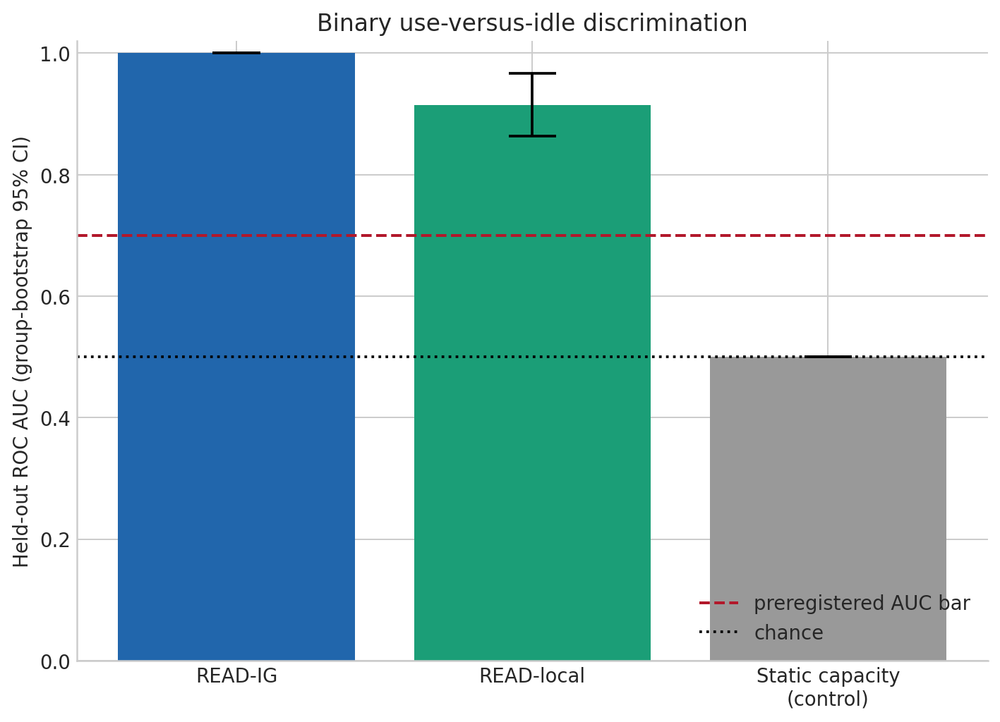
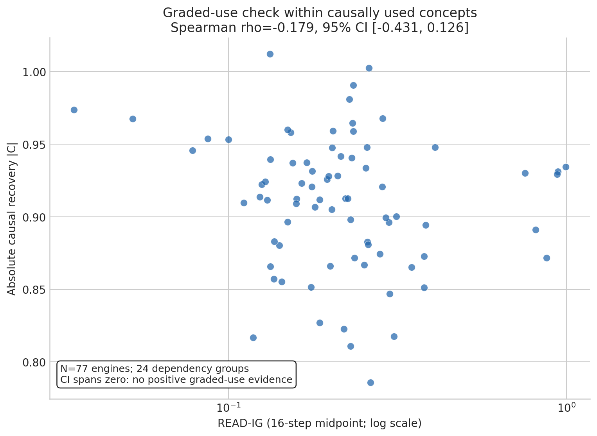
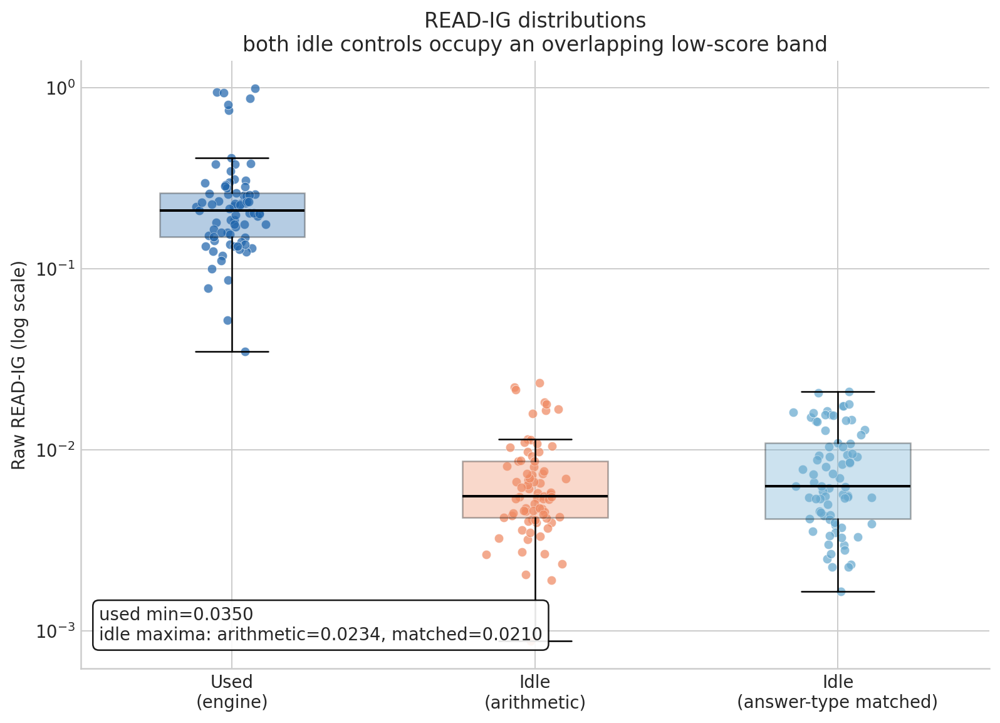
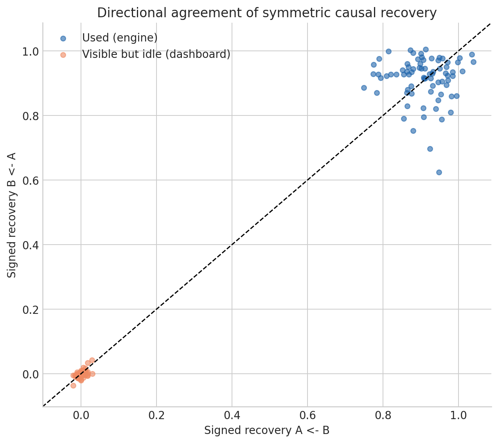

# Final results

## Verdict

**Binary relevant-vs-idle detector: supported. Graded causal-use meter: not supported. Final stress-test label: ARTIFACT (partial).**

On the frozen Qwen2.5-7B-Instruct experiment, READ_IG separates causally used explicit concepts from causally idle explicit concepts, including answer-type-matched controls. It does not rank causal magnitude among the already-strong engine examples.

## Scope and dataset

- Model: `Qwen/Qwen2.5-7B-Instruct` at pinned revision `a09a35458c702b33eeacc393d103063234e8bc28` in bf16.
- Measurement: layer L16, explicit single concept token, WRITTEN threshold `2.482431`.
- Candidates: 118; calibration: 25; held-out evaluation: 93.
- Verified held-out pairs: 77 in 24 dependency groups; 16 remained UNVERIFIED.
- Inference: five whole-group folds and 10,000 dependency-group bootstrap draws, seed 1729.

The labels used for ROC AUC are the constructed relevant-engine versus idle-control task classes. They are validated by causal interchange; they are not labels created by thresholding C.

## Causal sanity

| class | N | median signed C (grouped 95% CI) | median |C| (grouped 95% CI) |
| --- | ---: | --- | --- |
| relevant engine | 77 | 0.912714 [0.896378, 0.929191] | 0.912714 [0.896378, 0.929191] |
| original idle dashboard | 77 | -0.002043 [-0.003652, 0.002326] | 0.005083 [0.003587, 0.007752] |
| answer-type-matched idle dashboard | 77 | 0.001235 [-0.001546, 0.005780] | 0.006466 [0.004013, 0.010064] |

No class produced a preregistered sharp directional-disagreement flag. Full-residual C is signed and unclipped.

## Binary detection

| comparison / estimator | held-out AUC | grouped 95% CI |
| --- | ---: | --- |
| READ_IG, engine vs original idle | 1.000000 | [1.000000, 1.000000] |
| READ_IG, engine vs answer-matched idle | 1.000000 | [1.000000, 1.000000] |
| READ_local, engine vs original idle | 0.914825 | [0.863661, 0.967161] |
| static capacity control | 0.500000 | [0.500000, 0.500000] |

The answer-type-matched control shows that arithmetic output type is not the sole source of binary separation. No wall-clock benchmark was run, so READ is described precisely as gradient-only, donor-free, and intervention-output-free—not as an empirically timed speedup.

## Graded-use stress test

Within the 77 engines, READ_IG has Spearman rho `-0.179110` with |C|, with grouped 95% CI `[-0.431377, 0.126014]`. The CI spans zero and the point estimate is negative. Engine |C| occupies a narrow strong range from `0.785789` to `1.012025`. No weak/strong AUC was invented after inspection (`NOT_RUN_NO_PREREGISTERED_OR_NATURAL_SPLIT`).

The pooled rho `0.707412` is descriptive of the engine/control class gap and is not evidence that READ_IG resolves graded causal strength inside engines.

## Raw READ_IG distributions

| class | min | median | max | IQR |
| --- | ---: | ---: | ---: | ---: |
| engine | 0.034970 | 0.210247 | 0.992770 | 0.113284 |
| original idle | 0.000881 | 0.005553 | 0.023411 | 0.004459 |
| answer-matched idle | 0.001650 | 0.006319 | 0.021032 | 0.006783 |

The two idle ranges overlap across `86.0%` of their union and both remain disjoint from engines on this roster.

## Firewall and provenance

`src/cheap_read.py` imports no causal, patching, or intervention module. Notebook 03 consumes only the sanitized manifest and direction cache and freezes both old and hard-control READ values before notebook 04 computes hard causal truth.

The post-refactor comparison checked 80 scientific fields with absolute/relative tolerance 1e-3: **PASS**, with 0 regressions. See `PROVENANCE_pre_refactor.json`, `PROVENANCE_post_refactor.json`, and `PROVENANCE_comparison.json`.
