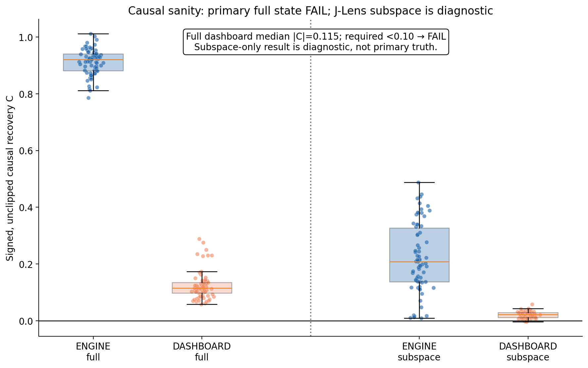
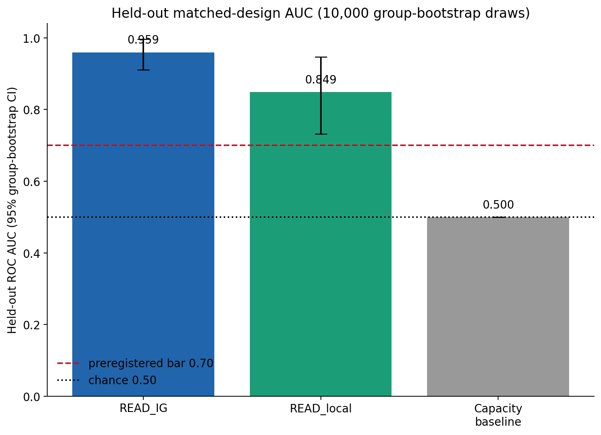
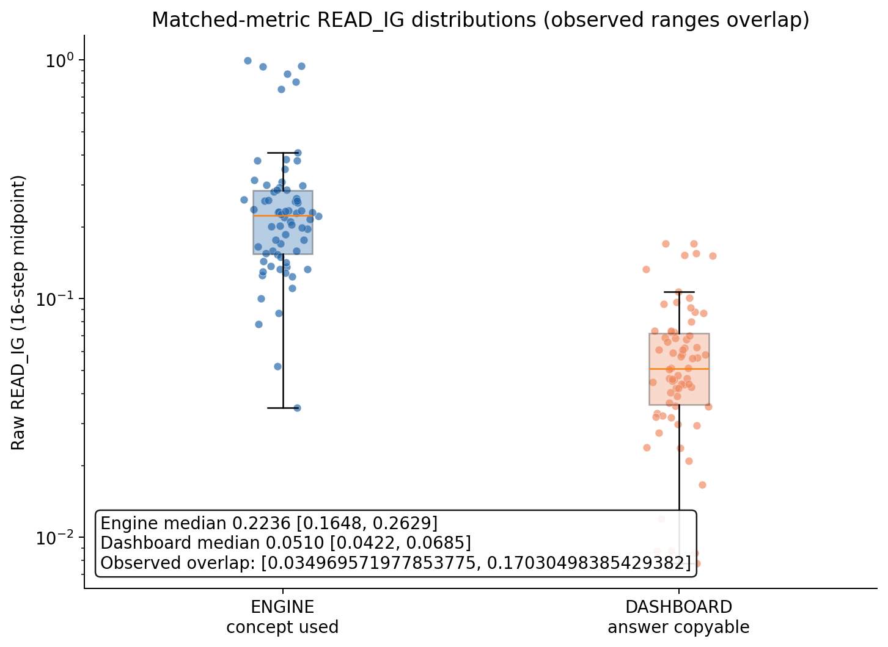
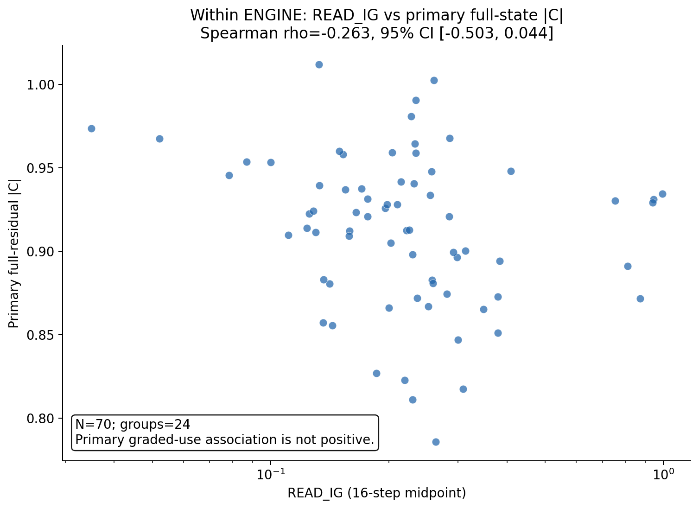

# V7 matched-comparison results

## Pre-registered decision rule

Pre-registered on 2026-07-09 before generating, inspecting, or evaluating any
v7 matched-design model outputs.

The primary held-out test compares ENGINE with the matched idle-DASHBOARD using
the identical measured quantity in both conditions:

`M = logit(answer_A) - logit(answer_B)`

`READ_IG` **passes** only if its dependency-group-held-out ROC AUC is at least
`0.70` and the lower endpoint of its 10,000-draw dependency-group bootstrap
confidence interval is strictly greater than `0.50`.

The frozen 16-step `READ_IG` estimator and frozen `READ_local` estimator will
not be tuned, sign-flipped, or redefined after inspecting v7 results. Failed
verification items are `UNVERIFIED`, excluded from confirmatory evaluation,
and never relabeled.

The final decision will use exactly one of these forms:

- **SURVIVES:** AUC stays high on the matched design; use-vs-idle detection is
  real in this frozen setting and is not explained by the old mismatched logit
  comparison.
- **COLLAPSES:** AUC drops toward chance on the matched design; the prior
  `1.000` was a mismatched-comparison design artifact and is corrected here.

## Results

### Outcome

**SURVIVES: AUC stays high on the matched design; the old metric mismatch does not solely explain the frozen READ_IG separation.**

Qualification: the primary full-residual copy-dashboard sanity gate failed
(`median |C|=0.114856` versus the
recorded `<0.10` criterion). The matched AUC therefore supports discrimination
of strong versus weak explicit-concept use in this frozen setting; it does not
establish perfectly idle dashboards under full-state interchange.

The earlier `1.000` result remains superseded and inadmissible as matched-metric
evidence. The new result shows that the old mismatch was not the sole source of
separation; it does not retroactively validate the old design.

### Dataset and verification

- Candidates: **118** (target was at least 90).
- Calibration-only: **25**; gate-passing calibration
  rows: **23**.
- Held-out evaluation candidates: **93**.
- `VERIFIED`: **70** across
  **24** dependency groups
  (target was at least 50).
- `UNVERIFIED`: **23**, excluded from C, READ, and all
  confirmatory statistics without relabeling.
- Verified fold counts (0–4):
  **8, 8, 21, 17, 16**.
- HF/J-Lens logit check: 20 prompts, maximum mean KL
  `1.660e-08 < 1e-3`.

UNVERIFIED reason counts (one row may have multiple reasons):

| Reason | Count |
| --- | ---: |
| `DASHBOARD_A_CONCEPT_NOT_WRITTEN` | 8 |
| `DASHBOARD_A_TARGET_NOT_TOP1` | 2 |
| `DASHBOARD_B_CONCEPT_NOT_WRITTEN` | 9 |
| `DASHBOARD_B_TARGET_NOT_TOP1` | 6 |
| `ENGINE_A_CONCEPT_NOT_WRITTEN` | 8 |
| `ENGINE_B_CONCEPT_NOT_WRITTEN` | 9 |

Every retained row passed four exact-argmax top-1 checks and four independently
measured WRITTEN checks at L16. The threshold remained frozen at
`2.482430934906006`.

### Identical metric and prompt contract

Both conditions use the same answer tokens, answer type, and quantity:

`M = logit(answer_A) - logit(answer_B)`

For the aluminum/magnesium example, those IDs are `1674` (` Al`) and `72593`
(` Mg`) in both conditions. No arithmetic task occurs in v7. The engine requires
the explicitly written concept-to-answer relation; the dashboard supplies a
self-contained later concept-answer fact and asks the model to copy the answer.

Because WRITTEN and interchange require an explicit concept-token site, the
engine's shared prefix states the intermediate concept. V7 therefore tests use
of an explicitly written concept-to-answer relation, not literal recovery of the
concept name from the original clue alone. This is the operational reconciliation
of the brief's simultaneous explicit-token and inference requirements.

### Causal design sanity

All C values below are signed and unclipped per pair; the table reports median
`|C|` with 10,000-draw dependency-group bootstrap intervals.

| Condition | Variant | Median | 95% CI | Gate role |
| --- | --- | ---: | ---: | --- |
| ENGINE | Full residual | 0.920756 | [0.897151, 0.931514] | Primary |
| DASHBOARD | Full residual | 0.114856 | [0.101803, 0.130208] | Primary |
| ENGINE | J-Lens two-concept subspace | 0.208611 | [0.144250, 0.305310] | Diagnostic |
| DASHBOARD | J-Lens two-concept subspace | 0.021994 | [0.012807, 0.026823] | Diagnostic |

Full-residual interchange produced large engine effects, but the intended copy
dashboard did not meet the recorded near-zero criterion: median `|C|` was
`0.114856` versus required
`<0.10`. Primary causal-design sanity is therefore **FAIL**.
The J-Lens subspace edit was more selective, but it was not primary truth and
cannot convert that FAIL into a PASS.

### Held-out matched-design discrimination

Pooled held-out AUC uses every VERIFIED evaluation row. Intervals use 10,000
whole-dependency-group bootstrap draws (seed 1729); fold AUCs are diagnostics,
not an averaged primary statistic.

| Estimator | AUC | 95% CI | Primary decision input |
| --- | ---: | ---: | --- |
| READ_IG | 0.959388 | [0.910429, 0.995983] | Yes |
| READ_local | 0.848571 | [0.731798, 0.946879] | No |
| Capacity baseline | 0.500000 | [0.500000, 0.500000] | No |

READ_IG fold AUCs: fold 0 `0.875000`, fold 1 `0.921875`, fold 2 `1.000000`, fold 3 `0.934256`, fold 4 `1.000000`.

### Raw READ_IG distributions

The observed ranges are **OVERLAPPING**, not disjoint.

| Condition | Median | 95% group CI | Observed range |
| --- | ---: | ---: | ---: |
| ENGINE | 0.223556 | [0.164827, 0.262948] | [0.034970, 0.992770] |
| DASHBOARD | 0.050954 | [0.042245, 0.068464] | [0.007785, 0.170305] |

Observed intersection: `[0.034969571977853775, 0.17030498385429382]`. Fraction of engines inside
the dashboard range: `0.314`; fraction of
dashboards inside the engine range: `0.771`.
This is an observed-range diagnostic, not a fitted density-overlap estimate.

### Within-engine graded check

Primary full-state `Spearman rho(READ_IG, |C|) = -0.263407` with
95% group-bootstrap CI `[-0.503426, 0.043532]`.
The estimate is negative and the interval includes zero, so v7 supplies no
positive evidence that READ_IG is a graded causal-strength meter within engines.

### Pre-READ correction history

Three corrections are retained rather than overwritten. Attempt 1 already used
the matched logit metric, but its pronoun-copy dashboard left the first concept
token causally active; full-state dashboard median `|C|` was `0.226190`, so it
was rejected before any READ score. Attempt 2 used the self-contained copy fact,
but batched verification disagreed with the canonical single-prompt causal
forward. Attempt 3 used a single-prompt all-ones mask, which still selected a
different path for a tied-max item. Final verification used single-prompt,
no-mask, hooked forwards matching causal execution and exact `argmax` top-1.

Verified counts only shrank: `77 → 71 → 71 → 70`.
No failed evaluation item was rescued or relabeled. The AUC bar remained the
commit-first rule at `f293ea3`, and no READ class comparison
was inspected during these corrections.

### Frozen estimator and firewall

- `READ_IG`: unchanged 16-step midpoint estimator.
- Frozen source SHA-256: `a4a0ab35c50ce73dd153414118e6150891a708acf5f64bf9c8cb31225bb0caab`.
- Causal artifact read by v7.3: `false`.
- Edited metrics/patch outputs consumed by v7.3: `false`.
- Sanitized manifest SHA remained identical before/after v7.3.
- Static import and shell grep audits found no causal, interchange,
  intervention, or patch import in the full local READ import closure.

### Deliverables, execution, and isolation

- Metrics: `results/v7/metrics_v7.json` (SHA-256 `66bcac9e8707e35ea37143aac0ebd3f1a15f2420f15e6cdc1873807af70f1aff`).
- Figures: all four required PNGs exist and passed size/label metadata checks.
- Notebook execution audit: **PASS**; all four executed:
  `true`.
- Isolation audit: **PASS**; only v7 paths changed from
  baseline `520e26d`: `true`.
- Frozen prior READ file unchanged: `a4a0ab35c50ce73dd153414118e6150891a708acf5f64bf9c8cb31225bb0caab`.
- Test suite, pytest, and Ruff were intentionally not run.
- Git branch: `v7-matched`; existing Git identity and remote were
  left unchanged.
